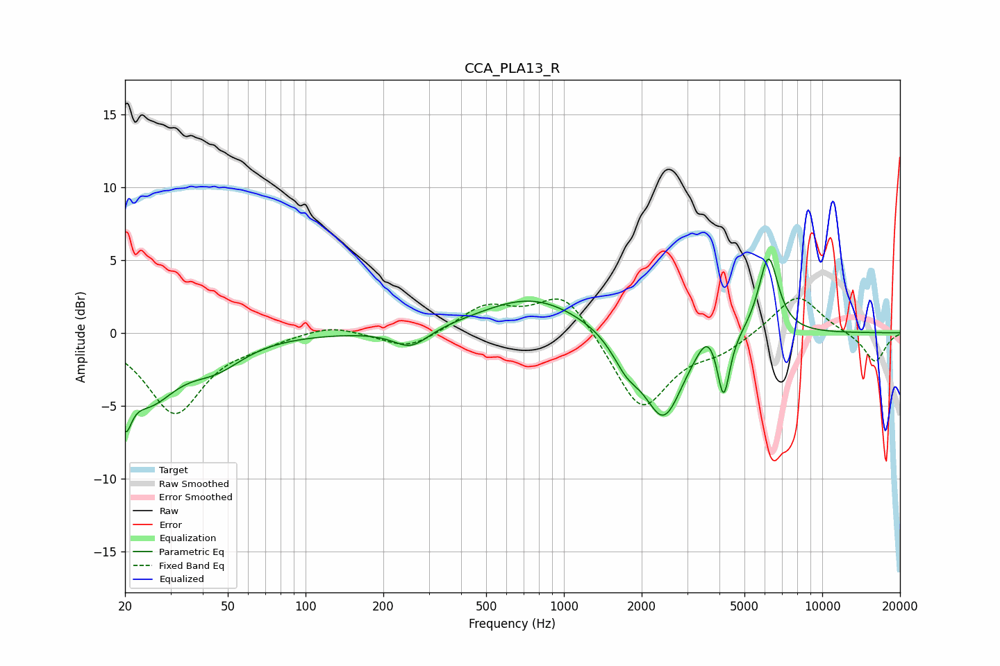

# CCA_PLA13_R
See [usage instructions](https://github.com/jaakkopasanen/AutoEq#usage) for more options and info.

### Parametric EQs
Apply preamp of -5.2 dB when using parametric equalizer.

|   # | Type    |   Fc (Hz) |    Q |   Gain (dB) |
|-----|---------|-----------|------|-------------|
|   1 | Peaking |        20 | 5.87 |        -3.2 |
|   2 | Peaking |        25 | 1.29 |        -4.2 |
|   3 | Peaking |        45 | 1.3  |        -1.7 |
|   4 | Peaking |       256 | 2.07 |        -1.3 |
|   5 | Peaking |       756 | 0.7  |         2.5 |
|   6 | Peaking |      1749 | 2.5  |        -1.8 |
|   7 | Peaking |      2434 | 1.87 |        -5.8 |
|   8 | Peaking |      3603 | 3.55 |         1.4 |
|   9 | Peaking |      4151 | 6    |        -4.4 |
|  10 | Peaking |      6192 | 3.57 |         5.4 |

### Fixed Band EQs
When using fixed band (also called graphic) equalizer, apply preamp of **-2.5 dB** (if available) and set gains manually with these parameters.

|   # | Type    |   Fc (Hz) |    Q |   Gain (dB) |
|-----|---------|-----------|------|-------------|
|   1 | Peaking |        31 | 1.41 |        -5.5 |
|   2 | Peaking |        62 | 1.41 |        -0.5 |
|   3 | Peaking |       125 | 1.41 |         0.6 |
|   4 | Peaking |       250 | 1.41 |        -1.2 |
|   5 | Peaking |       500 | 1.41 |         1.8 |
|   6 | Peaking |      1000 | 1.41 |         2.9 |
|   7 | Peaking |      2000 | 1.41 |        -5.4 |
|   8 | Peaking |      4000 | 1.41 |        -1.1 |
|   9 | Peaking |      8000 | 1.41 |         2.7 |
|  10 | Peaking |     16000 | 1.41 |        -2.1 |

### Graphs

