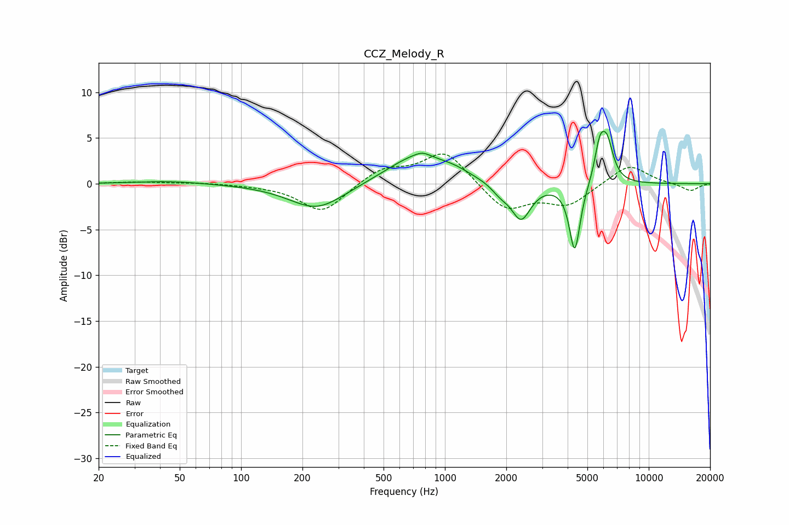

# CCZ_Melody_R
See [usage instructions](https://github.com/jaakkopasanen/AutoEq#usage) for more options and info.

### Parametric EQs
Apply preamp of -5.8 dB when using parametric equalizer.

|   # | Type    |   Fc (Hz) |    Q |   Gain (dB) |
|-----|---------|-----------|------|-------------|
|   1 | Peaking |        44 | 0.91 |         0.3 |
|   2 | Peaking |       236 | 1.03 |        -2.9 |
|   3 | Peaking |       735 | 0.96 |         3.2 |
|   4 | Peaking |       775 | 4.31 |         0.4 |
|   5 | Peaking |      1121 | 2.02 |         0.5 |
|   6 | Peaking |      1867 | 3.29 |        -0.9 |
|   7 | Peaking |      2363 | 2.93 |        -3.9 |
|   8 | Peaking |      4334 | 5.25 |        -7.5 |
|   9 | Peaking |      5745 | 5.53 |         3.5 |
|  10 | Peaking |      6239 | 4.42 |         4.2 |

### Fixed Band EQs
When using fixed band (also called graphic) equalizer, apply preamp of **-3.3 dB** (if available) and set gains manually with these parameters.

|   # | Type    |   Fc (Hz) |    Q |   Gain (dB) |
|-----|---------|-----------|------|-------------|
|   1 | Peaking |        31 | 1.41 |         0.2 |
|   2 | Peaking |        62 | 1.41 |         0.1 |
|   3 | Peaking |       125 | 1.41 |        -0.1 |
|   4 | Peaking |       250 | 1.41 |        -3.2 |
|   5 | Peaking |       500 | 1.41 |         1.7 |
|   6 | Peaking |      1000 | 1.41 |         3.6 |
|   7 | Peaking |      2000 | 1.41 |        -3   |
|   8 | Peaking |      4000 | 1.41 |        -2.2 |
|   9 | Peaking |      8000 | 1.41 |         2.2 |
|  10 | Peaking |     16000 | 1.41 |        -0.8 |

### Graphs

