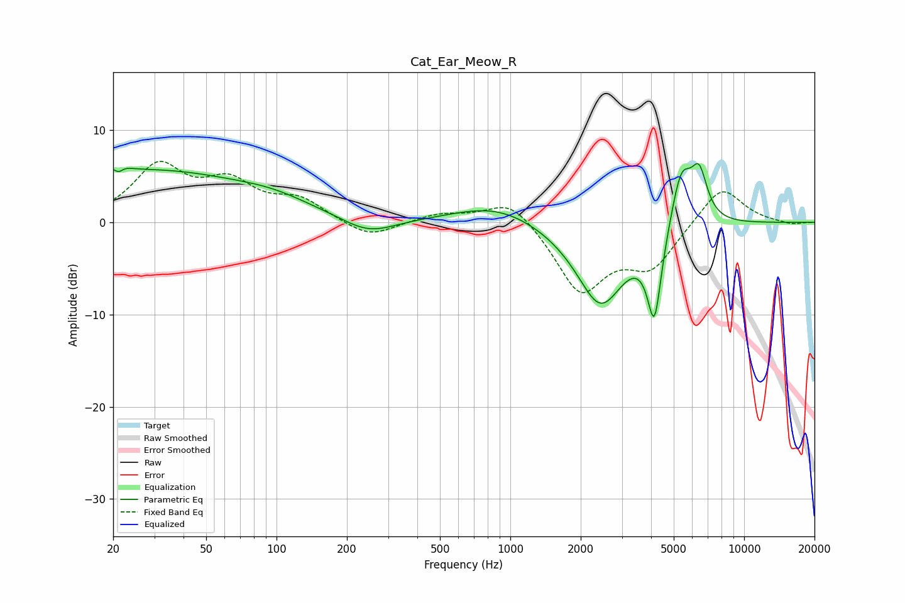

# Cat_Ear_Meow_R
See [usage instructions](https://github.com/jaakkopasanen/AutoEq#usage) for more options and info.

### Parametric EQs
Apply preamp of -6.4 dB when using parametric equalizer.

|   # | Type    |   Fc (Hz) |    Q |   Gain (dB) |
|-----|---------|-----------|------|-------------|
|   1 | Peaking |        21 | 4.81 |         3.5 |
|   2 | Peaking |        21 | 5.93 |        -3.4 |
|   3 | Peaking |        28 | 0.31 |         5.5 |
|   4 | Peaking |        97 | 0.88 |         1   |
|   5 | Peaking |       247 | 1.23 |        -1.8 |
|   6 | Peaking |       872 | 0.78 |         2   |
|   7 | Peaking |      2432 | 1.32 |        -9.1 |
|   8 | Peaking |      4134 | 4.53 |        -9.5 |
|   9 | Peaking |      5384 | 2.98 |         6.5 |
|  10 | Peaking |      6425 | 3.93 |         4.9 |

### Fixed Band EQs
When using fixed band (also called graphic) equalizer, apply preamp of **-6.7 dB** (if available) and set gains manually with these parameters.

|   # | Type    |   Fc (Hz) |    Q |   Gain (dB) |
|-----|---------|-----------|------|-------------|
|   1 | Peaking |        31 | 1.41 |         5.8 |
|   2 | Peaking |        62 | 1.41 |         3.8 |
|   3 | Peaking |       125 | 1.41 |         2.2 |
|   4 | Peaking |       250 | 1.41 |        -1.8 |
|   5 | Peaking |       500 | 1.41 |         0.9 |
|   6 | Peaking |      1000 | 1.41 |         2.8 |
|   7 | Peaking |      2000 | 1.41 |        -7.4 |
|   8 | Peaking |      4000 | 1.41 |        -4.5 |
|   9 | Peaking |      8000 | 1.41 |         4.1 |
|  10 | Peaking |     16000 | 1.41 |        -0.3 |

### Graphs

