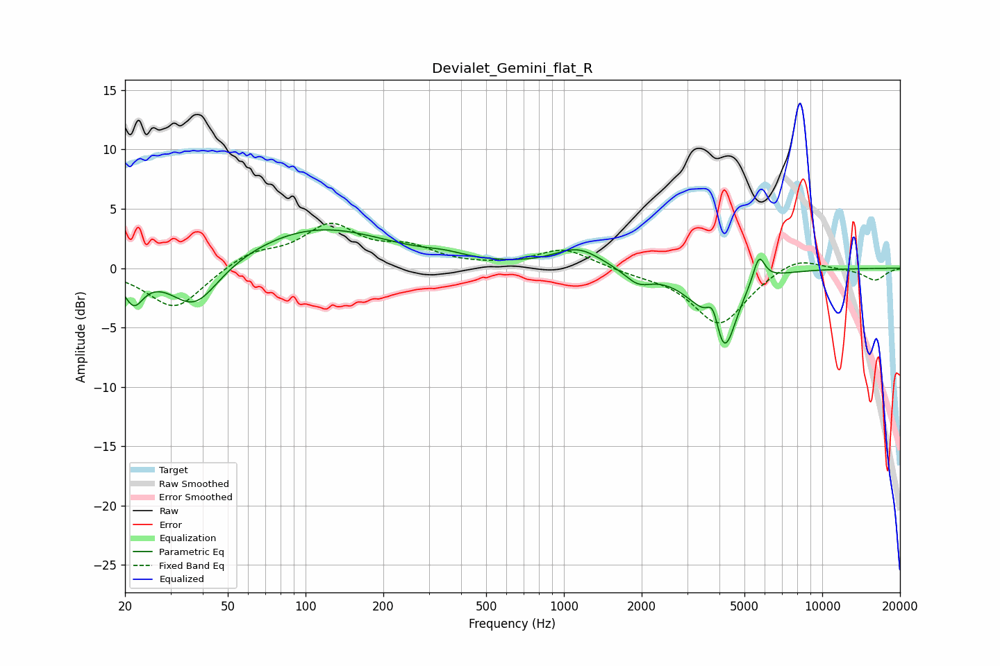

# Devialet_Gemini_flat_R
See [usage instructions](https://github.com/jaakkopasanen/AutoEq#usage) for more options and info.

### Parametric EQs
Apply preamp of -3.3 dB when using parametric equalizer.

|   # | Type    |   Fc (Hz) |    Q |   Gain (dB) |
|-----|---------|-----------|------|-------------|
|   1 | Peaking |        22 | 3.71 |        -2.6 |
|   2 | Peaking |        37 | 1.48 |        -3.9 |
|   3 | Peaking |       111 | 0.51 |         3.4 |
|   4 | Peaking |       345 | 1.9  |         0.4 |
|   5 | Peaking |      1135 | 1.54 |         1.7 |
|   6 | Peaking |      1936 | 2.67 |        -1.2 |
|   7 | Peaking |      3521 | 1.52 |        -2.1 |
|   8 | Peaking |      3786 | 5.83 |         2.5 |
|   9 | Peaking |      4162 | 3.05 |        -5.9 |
|  10 | Peaking |      5689 | 6    |         2.3 |

### Fixed Band EQs
When using fixed band (also called graphic) equalizer, apply preamp of **-3.9 dB** (if available) and set gains manually with these parameters.

|   # | Type    |   Fc (Hz) |    Q |   Gain (dB) |
|-----|---------|-----------|------|-------------|
|   1 | Peaking |        31 | 1.41 |        -3.5 |
|   2 | Peaking |        62 | 1.41 |         1.3 |
|   3 | Peaking |       125 | 1.41 |         3.4 |
|   4 | Peaking |       250 | 1.41 |         1.5 |
|   5 | Peaking |       500 | 1.41 |         0   |
|   6 | Peaking |      1000 | 1.41 |         1.6 |
|   7 | Peaking |      2000 | 1.41 |        -0.4 |
|   8 | Peaking |      4000 | 1.41 |        -4.8 |
|   9 | Peaking |      8000 | 1.41 |         1.1 |
|  10 | Peaking |     16000 | 1.41 |        -1   |

### Graphs

