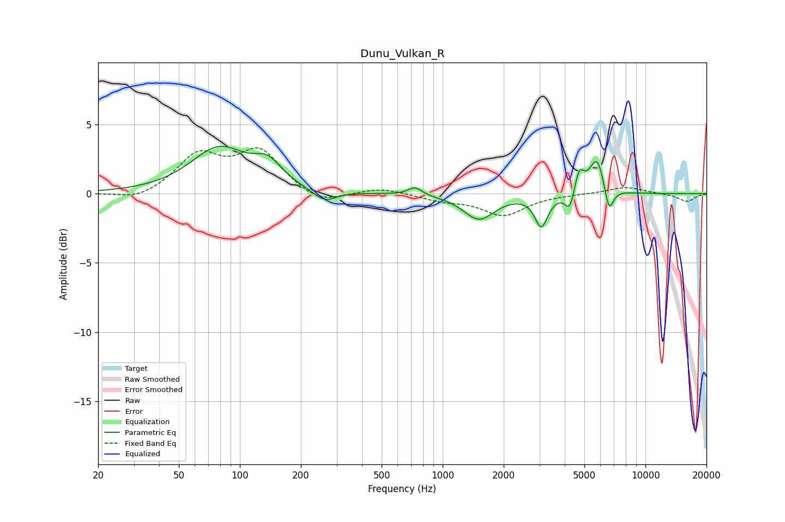

# Dunu_Vulkan_R
See [usage instructions](https://github.com/jaakkopasanen/AutoEq#usage) for more options and info.

### Parametric EQs
Apply preamp of -3.5 dB when using parametric equalizer.

|   # | Type    |   Fc (Hz) |    Q |   Gain (dB) |
|-----|---------|-----------|------|-------------|
|   1 | Peaking |        79 | 1.02 |         3.2 |
|   2 | Peaking |       138 | 2.04 |         1.5 |
|   3 | Peaking |       262 | 2.45 |        -0.9 |
|   4 | Peaking |       731 | 4.26 |         0.6 |
|   5 | Peaking |      1510 | 1.85 |        -1.8 |
|   6 | Peaking |      3068 | 4.45 |        -2.3 |
|   7 | Peaking |      4240 | 6    |        -1.4 |
|   8 | Peaking |      4710 | 6    |         1.7 |
|   9 | Peaking |      5783 | 3.61 |         2.7 |
|  10 | Peaking |      6599 | 5.96 |        -2.1 |

### Fixed Band EQs
When using fixed band (also called graphic) equalizer, apply preamp of **-3.4 dB** (if available) and set gains manually with these parameters.

|   # | Type    |   Fc (Hz) |    Q |   Gain (dB) |
|-----|---------|-----------|------|-------------|
|   1 | Peaking |        31 | 1.41 |        -0.6 |
|   2 | Peaking |        62 | 1.41 |         2.7 |
|   3 | Peaking |       125 | 1.41 |         3   |
|   4 | Peaking |       250 | 1.41 |        -0.9 |
|   5 | Peaking |       500 | 1.41 |         0.4 |
|   6 | Peaking |      1000 | 1.41 |        -0.4 |
|   7 | Peaking |      2000 | 1.41 |        -1.5 |
|   8 | Peaking |      4000 | 1.41 |        -0   |
|   9 | Peaking |      8000 | 1.41 |         0.5 |
|  10 | Peaking |     16000 | 1.41 |        -0.6 |

### Graphs

