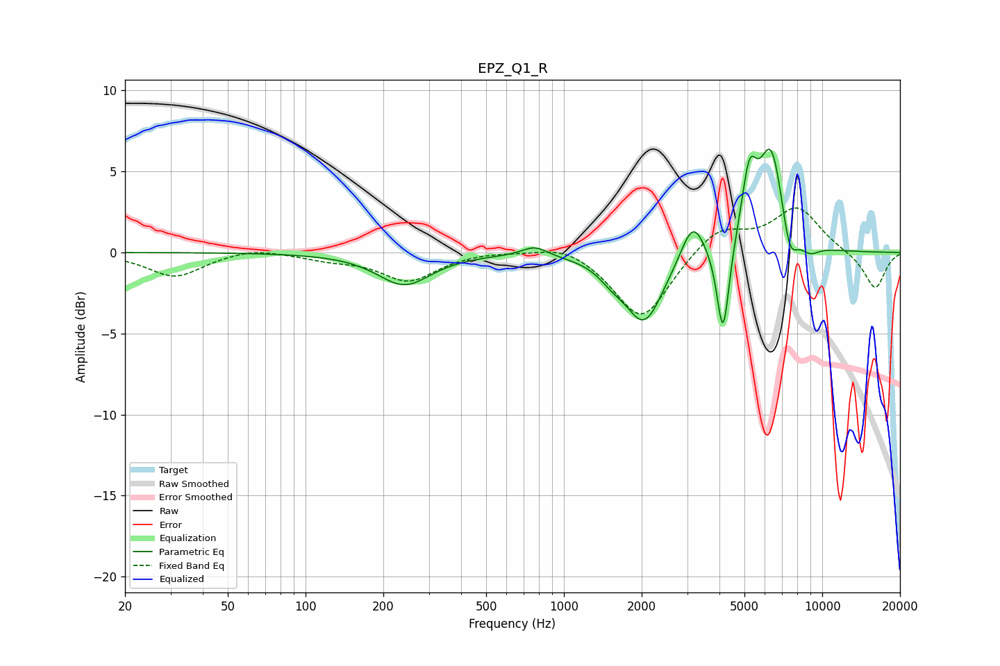

# EPZ_Q1_R
See [usage instructions](https://github.com/jaakkopasanen/AutoEq#usage) for more options and info.

### Parametric EQs
Apply preamp of -6.5 dB when using parametric equalizer.

|   # | Type    |   Fc (Hz) |    Q |   Gain (dB) |
|-----|---------|-----------|------|-------------|
|   1 | Peaking |       241 | 1.37 |        -2   |
|   2 | Peaking |       770 | 2.84 |         0.6 |
|   3 | Peaking |      1529 | 2.77 |        -0.7 |
|   4 | Peaking |      2048 | 1.91 |        -4.3 |
|   5 | Peaking |      3153 | 3.15 |         2.4 |
|   6 | Peaking |      4132 | 5.96 |        -5.8 |
|   7 | Peaking |      5220 | 4.73 |         4   |
|   8 | Peaking |      6349 | 2.78 |         6.4 |
|   9 | Peaking |      7473 | 4.43 |        -2.3 |
|  10 | Peaking |      8944 | 3.44 |        -0.6 |

### Fixed Band EQs
When using fixed band (also called graphic) equalizer, apply preamp of **-2.8 dB** (if available) and set gains manually with these parameters.

|   # | Type    |   Fc (Hz) |    Q |   Gain (dB) |
|-----|---------|-----------|------|-------------|
|   1 | Peaking |        31 | 1.41 |        -1.5 |
|   2 | Peaking |        62 | 1.41 |         0.4 |
|   3 | Peaking |       125 | 1.41 |        -0.4 |
|   4 | Peaking |       250 | 1.41 |        -1.7 |
|   5 | Peaking |       500 | 1.41 |         0.1 |
|   6 | Peaking |      1000 | 1.41 |         0.6 |
|   7 | Peaking |      2000 | 1.41 |        -4.2 |
|   8 | Peaking |      4000 | 1.41 |         1.6 |
|   9 | Peaking |      8000 | 1.41 |         2.7 |
|  10 | Peaking |     16000 | 1.41 |        -2.3 |

### Graphs

