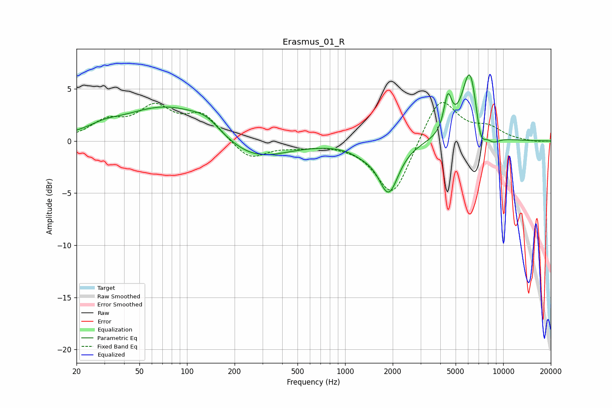

# Erasmus_01_R
See [usage instructions](https://github.com/jaakkopasanen/AutoEq#usage) for more options and info.

### Parametric EQs
Apply preamp of -6.4 dB when using parametric equalizer.

|   # | Type    |   Fc (Hz) |    Q |   Gain (dB) |
|-----|---------|-----------|------|-------------|
|   1 | Peaking |        30 | 1.46 |         0.5 |
|   2 | Peaking |        77 | 0.49 |         3.5 |
|   3 | Peaking |       132 | 1.68 |         0.9 |
|   4 | Peaking |       253 | 0.67 |        -2.3 |
|   5 | Peaking |      1298 | 1.76 |        -0.6 |
|   6 | Peaking |      1884 | 2.24 |        -4.7 |
|   7 | Peaking |      4465 | 5.67 |         3.4 |
|   8 | Peaking |      6172 | 2.69 |         7.2 |
|   9 | Peaking |      7169 | 4.12 |        -2.8 |
|  10 | Peaking |      8582 | 2.89 |        -0.8 |

### Fixed Band EQs
When using fixed band (also called graphic) equalizer, apply preamp of **-3.8 dB** (if available) and set gains manually with these parameters.

|   # | Type    |   Fc (Hz) |    Q |   Gain (dB) |
|-----|---------|-----------|------|-------------|
|   1 | Peaking |        31 | 1.41 |         1.7 |
|   2 | Peaking |        62 | 1.41 |         2.9 |
|   3 | Peaking |       125 | 1.41 |         2.4 |
|   4 | Peaking |       250 | 1.41 |        -1.9 |
|   5 | Peaking |       500 | 1.41 |        -0.4 |
|   6 | Peaking |      1000 | 1.41 |        -0.1 |
|   7 | Peaking |      2000 | 1.41 |        -5.5 |
|   8 | Peaking |      4000 | 1.41 |         4.5 |
|   9 | Peaking |      8000 | 1.41 |         1.1 |
|  10 | Peaking |     16000 | 1.41 |        -0.1 |

### Graphs

