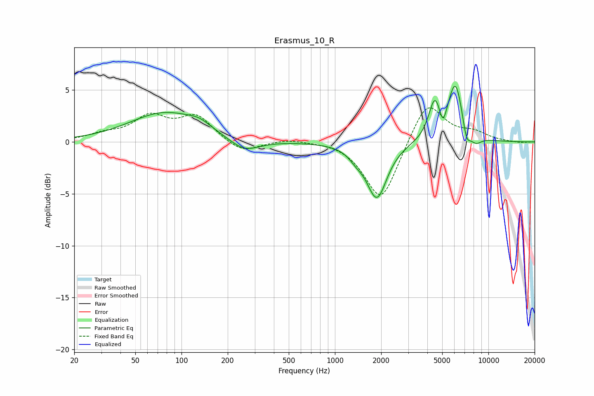

# Erasmus_10_R
See [usage instructions](https://github.com/jaakkopasanen/AutoEq#usage) for more options and info.

### Parametric EQs
Apply preamp of -5.5 dB when using parametric equalizer.

|   # | Type    |   Fc (Hz) |    Q |   Gain (dB) |
|-----|---------|-----------|------|-------------|
|   1 | Peaking |        78 | 0.62 |         2.8 |
|   2 | Peaking |       131 | 1.88 |         0.6 |
|   3 | Peaking |       256 | 1.44 |        -1.3 |
|   4 | Peaking |      1373 | 3.02 |        -0.7 |
|   5 | Peaking |      1875 | 2.14 |        -5.3 |
|   6 | Peaking |      4474 | 3.55 |         3.6 |
|   7 | Peaking |      5053 | 6    |        -1.7 |
|   8 | Peaking |      6101 | 2.75 |         5.7 |
|   9 | Peaking |      7193 | 5.15 |        -1.9 |
|  10 | Peaking |      8262 | 3.49 |        -0.9 |

### Fixed Band EQs
When using fixed band (also called graphic) equalizer, apply preamp of **-3.4 dB** (if available) and set gains manually with these parameters.

|   # | Type    |   Fc (Hz) |    Q |   Gain (dB) |
|-----|---------|-----------|------|-------------|
|   1 | Peaking |        31 | 1.41 |         0.6 |
|   2 | Peaking |        62 | 1.41 |         2.3 |
|   3 | Peaking |       125 | 1.41 |         2.4 |
|   4 | Peaking |       250 | 1.41 |        -1.1 |
|   5 | Peaking |       500 | 1.41 |         0.3 |
|   6 | Peaking |      1000 | 1.41 |         0.2 |
|   7 | Peaking |      2000 | 1.41 |        -5.8 |
|   8 | Peaking |      4000 | 1.41 |         4.2 |
|   9 | Peaking |      8000 | 1.41 |         0.8 |
|  10 | Peaking |     16000 | 1.41 |        -0.1 |

### Graphs

