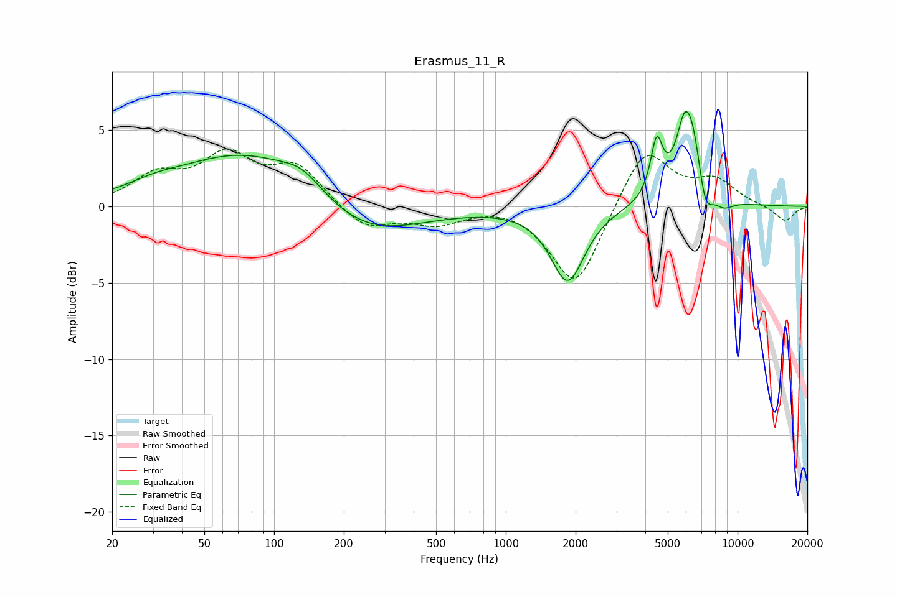

# Erasmus_11_R
See [usage instructions](https://github.com/jaakkopasanen/AutoEq#usage) for more options and info.

### Parametric EQs
Apply preamp of -6.3 dB when using parametric equalizer.

|   # | Type    |   Fc (Hz) |    Q |   Gain (dB) |
|-----|---------|-----------|------|-------------|
|   1 | Peaking |        30 | 1.25 |         0.5 |
|   2 | Peaking |        77 | 0.48 |         3.7 |
|   3 | Peaking |       133 | 1.57 |         1.1 |
|   4 | Peaking |       237 | 0.6  |        -2.5 |
|   5 | Peaking |      1850 | 1.96 |        -4.9 |
|   6 | Peaking |      4475 | 5.48 |         3.5 |
|   7 | Peaking |      5836 | 5.66 |         1.2 |
|   8 | Peaking |      6272 | 2.44 |         6.3 |
|   9 | Peaking |      7222 | 4    |        -2.9 |
|  10 | Peaking |      8666 | 2.84 |        -0.8 |

### Fixed Band EQs
When using fixed band (also called graphic) equalizer, apply preamp of **-3.9 dB** (if available) and set gains manually with these parameters.

|   # | Type    |   Fc (Hz) |    Q |   Gain (dB) |
|-----|---------|-----------|------|-------------|
|   1 | Peaking |        31 | 1.41 |         1.8 |
|   2 | Peaking |        62 | 1.41 |         3   |
|   3 | Peaking |       125 | 1.41 |         2.5 |
|   4 | Peaking |       250 | 1.41 |        -1.5 |
|   5 | Peaking |       500 | 1.41 |        -1   |
|   6 | Peaking |      1000 | 1.41 |         0.3 |
|   7 | Peaking |      2000 | 1.41 |        -5.4 |
|   8 | Peaking |      4000 | 1.41 |         4   |
|   9 | Peaking |      8000 | 1.41 |         1.6 |
|  10 | Peaking |     16000 | 1.41 |        -1   |

### Graphs

