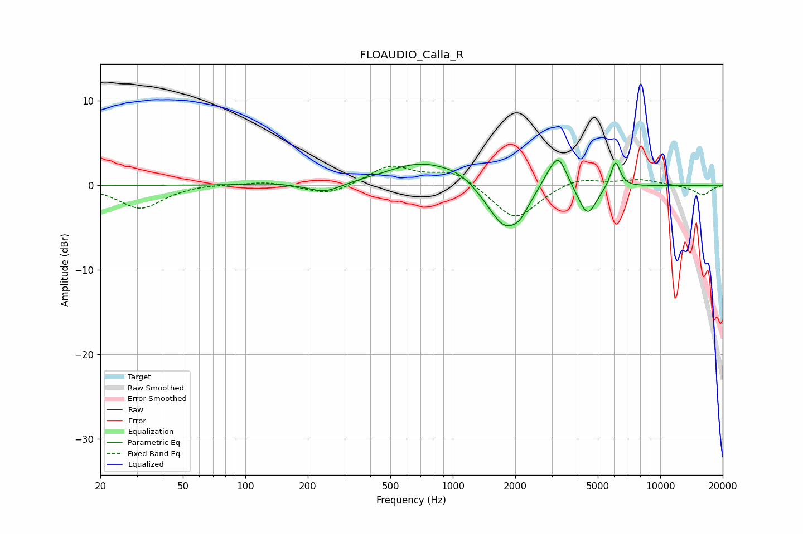

# FLOAUDIO_Calla_R
See [usage instructions](https://github.com/jaakkopasanen/AutoEq#usage) for more options and info.

### Parametric EQs
Apply preamp of -3.0 dB when using parametric equalizer.

|   # | Type    |   Fc (Hz) |    Q |   Gain (dB) |
|-----|---------|-----------|------|-------------|
|   1 | Peaking |       129 | 1.64 |         0.2 |
|   2 | Peaking |       242 | 1.8  |        -1.1 |
|   3 | Peaking |       718 | 0.81 |         2.8 |
|   4 | Peaking |      1080 | 1.81 |         0.7 |
|   5 | Peaking |      1785 | 1.65 |        -5.5 |
|   6 | Peaking |      2112 | 4    |        -1   |
|   7 | Peaking |      2863 | 3.14 |         1.1 |
|   8 | Peaking |      3236 | 3.43 |         3.7 |
|   9 | Peaking |      4458 | 3.21 |        -3.6 |
|  10 | Peaking |      6081 | 5.99 |         3.2 |

### Fixed Band EQs
When using fixed band (also called graphic) equalizer, apply preamp of **-2.4 dB** (if available) and set gains manually with these parameters.

|   # | Type    |   Fc (Hz) |    Q |   Gain (dB) |
|-----|---------|-----------|------|-------------|
|   1 | Peaking |        31 | 1.41 |        -2.8 |
|   2 | Peaking |        62 | 1.41 |         0.2 |
|   3 | Peaking |       125 | 1.41 |         0.5 |
|   4 | Peaking |       250 | 1.41 |        -1.2 |
|   5 | Peaking |       500 | 1.41 |         2.3 |
|   6 | Peaking |      1000 | 1.41 |         1.7 |
|   7 | Peaking |      2000 | 1.41 |        -4.2 |
|   8 | Peaking |      4000 | 1.41 |         1   |
|   9 | Peaking |      8000 | 1.41 |         0.7 |
|  10 | Peaking |     16000 | 1.41 |        -1.2 |

### Graphs

