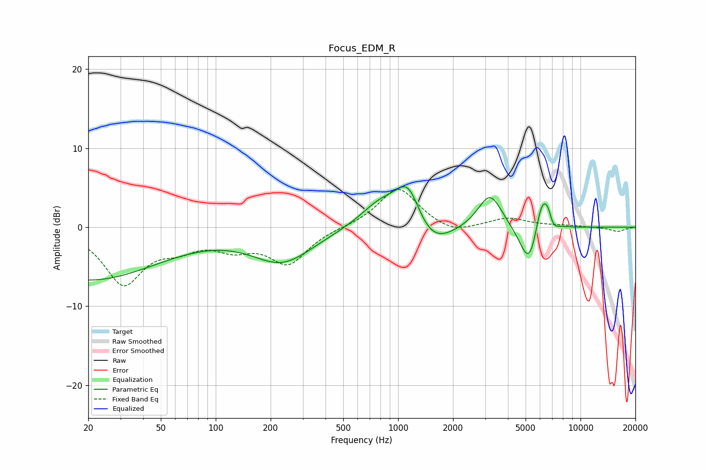

# Focus_EDM_R
See [usage instructions](https://github.com/jaakkopasanen/AutoEq#usage) for more options and info.

### Parametric EQs
Apply preamp of -5.2 dB when using parametric equalizer.

|   # | Type    |   Fc (Hz) |    Q |   Gain (dB) |
|-----|---------|-----------|------|-------------|
|   1 | Peaking |        20 | 0.36 |        -6.6 |
|   2 | Peaking |       232 | 0.84 |        -4.3 |
|   3 | Peaking |       806 | 1.23 |         3.2 |
|   4 | Peaking |      1137 | 1.97 |         5.7 |
|   5 | Peaking |      1485 | 1.22 |        -3.7 |
|   6 | Peaking |      3192 | 2.12 |         4.5 |
|   7 | Peaking |      5254 | 2.65 |        -5.9 |
|   8 | Peaking |      6125 | 3.56 |         4.9 |
|   9 | Peaking |      6654 | 5.63 |         1.6 |
|  10 | Peaking |      7041 | 5.45 |        -1.3 |

### Fixed Band EQs
When using fixed band (also called graphic) equalizer, apply preamp of **-4.9 dB** (if available) and set gains manually with these parameters.

|   # | Type    |   Fc (Hz) |    Q |   Gain (dB) |
|-----|---------|-----------|------|-------------|
|   1 | Peaking |        31 | 1.41 |        -6.9 |
|   2 | Peaking |        62 | 1.41 |        -1.9 |
|   3 | Peaking |       125 | 1.41 |        -2.1 |
|   4 | Peaking |       250 | 1.41 |        -4.4 |
|   5 | Peaking |       500 | 1.41 |         0   |
|   6 | Peaking |      1000 | 1.41 |         5.1 |
|   7 | Peaking |      2000 | 1.41 |        -1   |
|   8 | Peaking |      4000 | 1.41 |         1.1 |
|   9 | Peaking |      8000 | 1.41 |         0.2 |
|  10 | Peaking |     16000 | 1.41 |        -0.6 |

### Graphs

