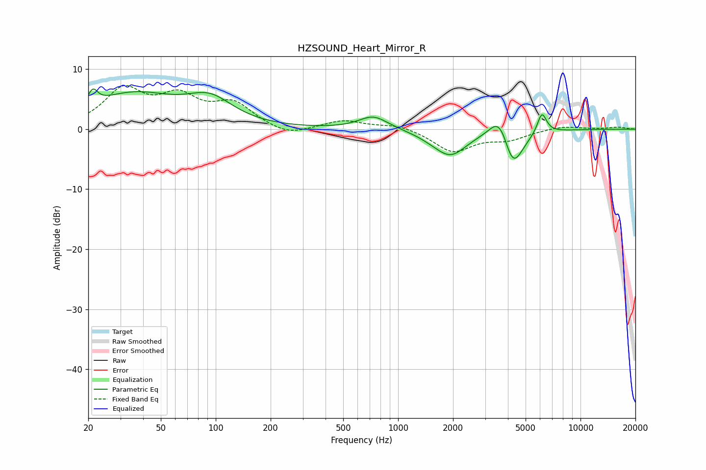

# HZSOUND_Heart_Mirror_R
See [usage instructions](https://github.com/jaakkopasanen/AutoEq#usage) for more options and info.

### Parametric EQs
Apply preamp of -6.8 dB when using parametric equalizer.

|   # | Type    |   Fc (Hz) |    Q |   Gain (dB) |
|-----|---------|-----------|------|-------------|
|   1 | Peaking |        21 | 5.47 |         2.4 |
|   2 | Peaking |        35 | 0.58 |         5.6 |
|   3 | Peaking |        93 | 1.13 |         3.9 |
|   4 | Peaking |       732 | 1.76 |         2.2 |
|   5 | Peaking |      1519 | 1.73 |        -0.5 |
|   6 | Peaking |      1939 | 1.6  |        -4.1 |
|   7 | Peaking |      3581 | 2.66 |         4.4 |
|   8 | Peaking |      3822 | 5.98 |         0.3 |
|   9 | Peaking |      4250 | 2.48 |        -6.8 |
|  10 | Peaking |      6145 | 5.42 |         3.5 |

### Fixed Band EQs
When using fixed band (also called graphic) equalizer, apply preamp of **-7.4 dB** (if available) and set gains manually with these parameters.

|   # | Type    |   Fc (Hz) |    Q |   Gain (dB) |
|-----|---------|-----------|------|-------------|
|   1 | Peaking |        31 | 1.41 |         6.2 |
|   2 | Peaking |        62 | 1.41 |         4.7 |
|   3 | Peaking |       125 | 1.41 |         3.9 |
|   4 | Peaking |       250 | 1.41 |        -1.3 |
|   5 | Peaking |       500 | 1.41 |         1.4 |
|   6 | Peaking |      1000 | 1.41 |         0.8 |
|   7 | Peaking |      2000 | 1.41 |        -3.7 |
|   8 | Peaking |      4000 | 1.41 |        -1.5 |
|   9 | Peaking |      8000 | 1.41 |         0.6 |
|  10 | Peaking |     16000 | 1.41 |         0.3 |

### Graphs

