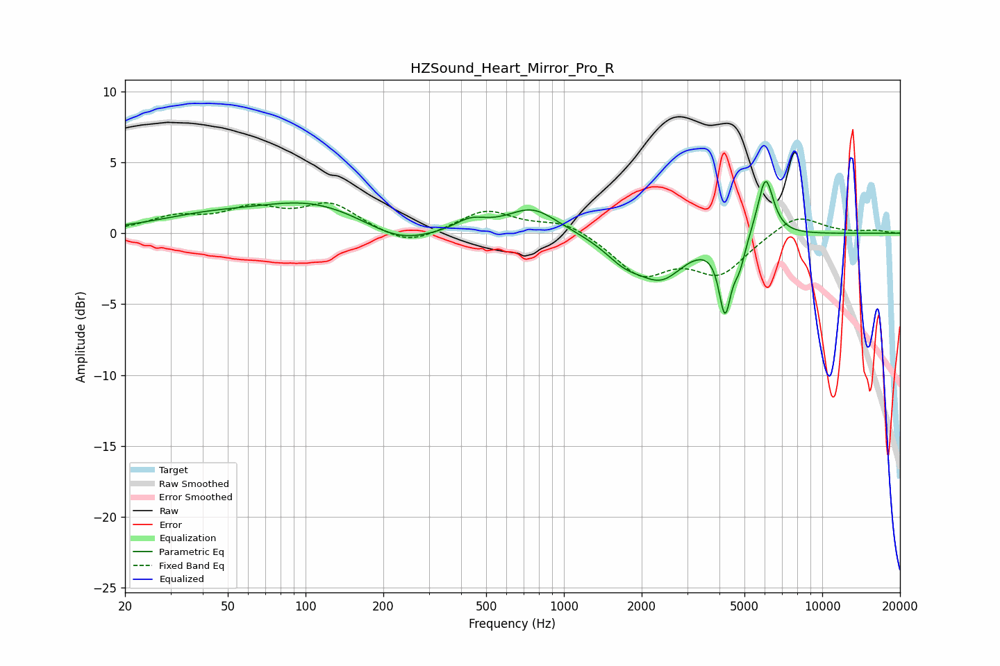

# HZSound_Heart_Mirror_Pro_R
See [usage instructions](https://github.com/jaakkopasanen/AutoEq#usage) for more options and info.

### Parametric EQs
Apply preamp of -3.7 dB when using parametric equalizer.

|   # | Type    |   Fc (Hz) |    Q |   Gain (dB) |
|-----|---------|-----------|------|-------------|
|   1 | Peaking |        41 | 0.68 |         0.9 |
|   2 | Peaking |       107 | 0.65 |         2   |
|   3 | Peaking |       230 | 1.07 |        -1.3 |
|   4 | Peaking |       435 | 2.32 |         0.8 |
|   5 | Peaking |       755 | 1.45 |         1.8 |
|   6 | Peaking |      1713 | 1.8  |        -1.4 |
|   7 | Peaking |      2388 | 1.57 |        -2.8 |
|   8 | Peaking |      4203 | 6    |        -4.9 |
|   9 | Peaking |      4778 | 5.98 |        -1.7 |
|  10 | Peaking |      6031 | 4.46 |         4.3 |

### Fixed Band EQs
When using fixed band (also called graphic) equalizer, apply preamp of **-2.2 dB** (if available) and set gains manually with these parameters.

|   # | Type    |   Fc (Hz) |    Q |   Gain (dB) |
|-----|---------|-----------|------|-------------|
|   1 | Peaking |        31 | 1.41 |         1   |
|   2 | Peaking |        62 | 1.41 |         1.5 |
|   3 | Peaking |       125 | 1.41 |         1.9 |
|   4 | Peaking |       250 | 1.41 |        -1   |
|   5 | Peaking |       500 | 1.41 |         1.6 |
|   6 | Peaking |      1000 | 1.41 |         0.9 |
|   7 | Peaking |      2000 | 1.41 |        -2.8 |
|   8 | Peaking |      4000 | 1.41 |        -2.7 |
|   9 | Peaking |      8000 | 1.41 |         1.4 |
|  10 | Peaking |     16000 | 1.41 |         0.2 |

### Graphs

