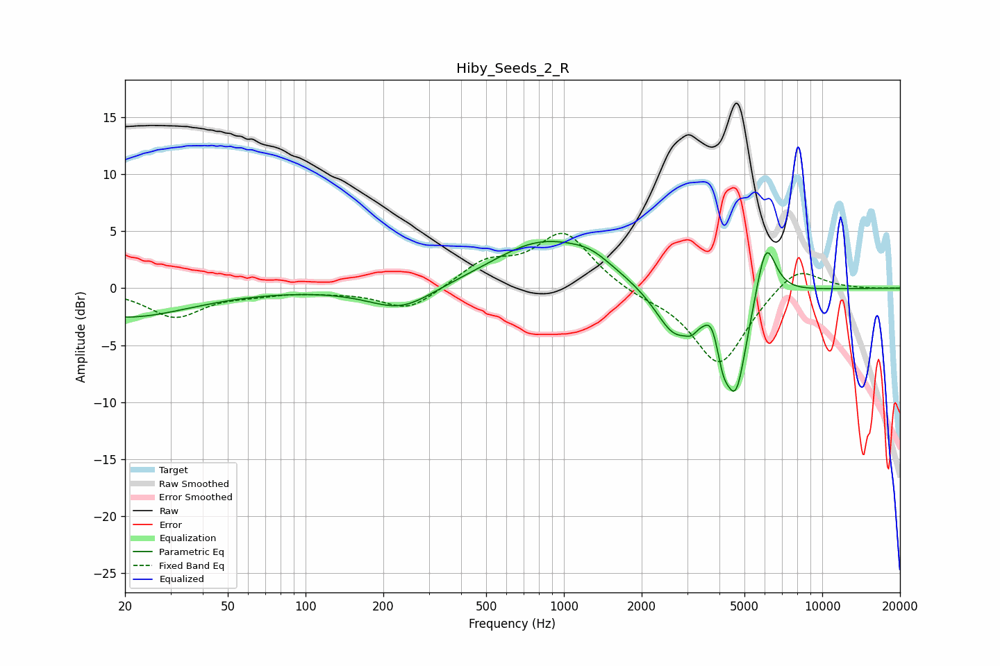

# Hiby_Seeds_2_R
See [usage instructions](https://github.com/jaakkopasanen/AutoEq#usage) for more options and info.

### Parametric EQs
Apply preamp of -4.2 dB when using parametric equalizer.

|   # | Type    |   Fc (Hz) |    Q |   Gain (dB) |
|-----|---------|-----------|------|-------------|
|   1 | Peaking |        20 | 0.56 |        -2.5 |
|   2 | Peaking |       235 | 1.12 |        -2.1 |
|   3 | Peaking |       825 | 0.72 |         4.1 |
|   4 | Peaking |      1270 | 1.68 |         1   |
|   5 | Peaking |      2678 | 1.86 |        -4   |
|   6 | Peaking |      3118 | 5.94 |        -0.7 |
|   7 | Peaking |      3731 | 5.97 |         1.2 |
|   8 | Peaking |      4130 | 6    |        -2.2 |
|   9 | Peaking |      4631 | 3.02 |        -8.9 |
|  10 | Peaking |      6048 | 3.5  |         5.5 |

### Fixed Band EQs
When using fixed band (also called graphic) equalizer, apply preamp of **-4.9 dB** (if available) and set gains manually with these parameters.

|   # | Type    |   Fc (Hz) |    Q |   Gain (dB) |
|-----|---------|-----------|------|-------------|
|   1 | Peaking |        31 | 1.41 |        -2.5 |
|   2 | Peaking |        62 | 1.41 |        -0.4 |
|   3 | Peaking |       125 | 1.41 |        -0.2 |
|   4 | Peaking |       250 | 1.41 |        -2   |
|   5 | Peaking |       500 | 1.41 |         2.1 |
|   6 | Peaking |      1000 | 1.41 |         4.8 |
|   7 | Peaking |      2000 | 1.41 |        -0.6 |
|   8 | Peaking |      4000 | 1.41 |        -6.8 |
|   9 | Peaking |      8000 | 1.41 |         2.2 |
|  10 | Peaking |     16000 | 1.41 |        -0   |

### Graphs

