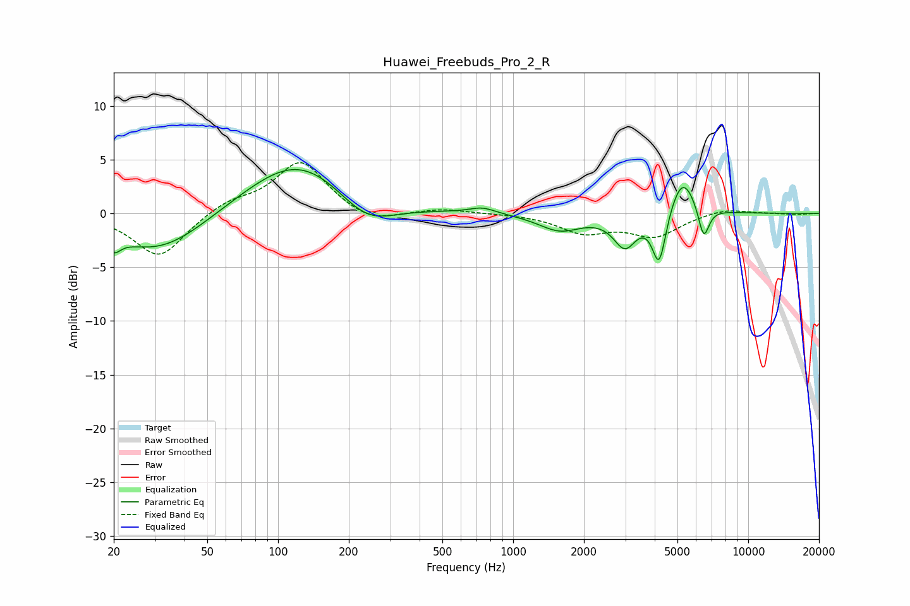

# Huawei_Freebuds_Pro_2_R
See [usage instructions](https://github.com/jaakkopasanen/AutoEq#usage) for more options and info.

### Parametric EQs
Apply preamp of -4.2 dB when using parametric equalizer.

|   # | Type    |   Fc (Hz) |    Q |   Gain (dB) |
|-----|---------|-----------|------|-------------|
|   1 | Peaking |        20 | 5    |        -1.3 |
|   2 | Peaking |        31 | 0.7  |        -3.8 |
|   3 | Peaking |       123 | 0.62 |         5.4 |
|   4 | Peaking |       237 | 1.12 |        -2.9 |
|   5 | Peaking |       741 | 2.48 |         0.6 |
|   6 | Peaking |      1580 | 1.56 |        -1.6 |
|   7 | Peaking |      2989 | 2.93 |        -2.9 |
|   8 | Peaking |      4180 | 4.8  |        -5   |
|   9 | Peaking |      5249 | 2.49 |         3.8 |
|  10 | Peaking |      6463 | 5.86 |        -3.1 |

### Fixed Band EQs
When using fixed band (also called graphic) equalizer, apply preamp of **-4.8 dB** (if available) and set gains manually with these parameters.

|   # | Type    |   Fc (Hz) |    Q |   Gain (dB) |
|-----|---------|-----------|------|-------------|
|   1 | Peaking |        31 | 1.41 |        -4.1 |
|   2 | Peaking |        62 | 1.41 |         1.1 |
|   3 | Peaking |       125 | 1.41 |         4.8 |
|   4 | Peaking |       250 | 1.41 |        -1.1 |
|   5 | Peaking |       500 | 1.41 |         0.4 |
|   6 | Peaking |      1000 | 1.41 |         0   |
|   7 | Peaking |      2000 | 1.41 |        -1.7 |
|   8 | Peaking |      4000 | 1.41 |        -2   |
|   9 | Peaking |      8000 | 1.41 |         0.5 |
|  10 | Peaking |     16000 | 1.41 |        -0.1 |

### Graphs

