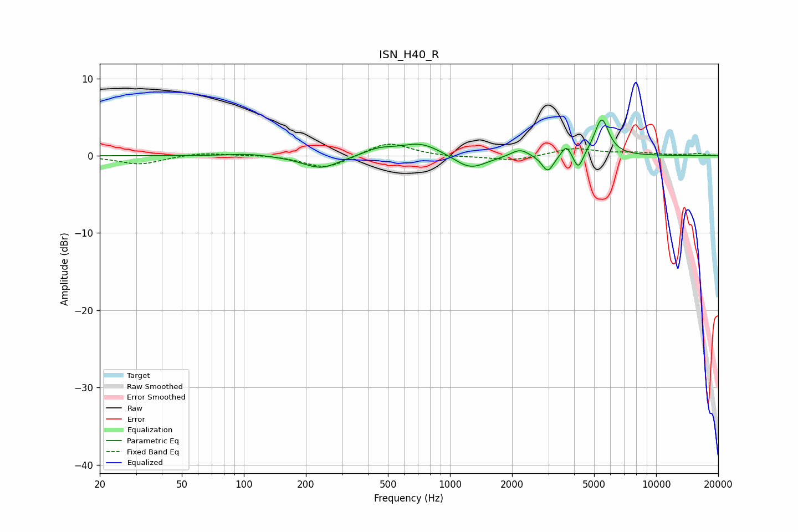

# ISN_H40_R
See [usage instructions](https://github.com/jaakkopasanen/AutoEq#usage) for more options and info.

### Parametric EQs
Apply preamp of -4.7 dB when using parametric equalizer.

|   # | Type    |   Fc (Hz) |    Q |   Gain (dB) |
|-----|---------|-----------|------|-------------|
|   1 | Peaking |       104 | 1.48 |         0.3 |
|   2 | Peaking |       236 | 1.6  |        -1.7 |
|   3 | Peaking |       450 | 1.97 |         0.8 |
|   4 | Peaking |       721 | 1.39 |         1.7 |
|   5 | Peaking |      1253 | 1.8  |        -1.9 |
|   6 | Peaking |      2182 | 3.31 |         1   |
|   7 | Peaking |      2981 | 4.99 |        -2.2 |
|   8 | Peaking |      3672 | 6    |         1.5 |
|   9 | Peaking |      4193 | 5.99 |        -2.3 |
|  10 | Peaking |      5442 | 4.01 |         4.8 |

### Fixed Band EQs
When using fixed band (also called graphic) equalizer, apply preamp of **-1.6 dB** (if available) and set gains manually with these parameters.

|   # | Type    |   Fc (Hz) |    Q |   Gain (dB) |
|-----|---------|-----------|------|-------------|
|   1 | Peaking |        31 | 1.41 |        -1.1 |
|   2 | Peaking |        62 | 1.41 |         0.4 |
|   3 | Peaking |       125 | 1.41 |         0.1 |
|   4 | Peaking |       250 | 1.41 |        -1.7 |
|   5 | Peaking |       500 | 1.41 |         1.8 |
|   6 | Peaking |      1000 | 1.41 |        -0.2 |
|   7 | Peaking |      2000 | 1.41 |        -0.7 |
|   8 | Peaking |      4000 | 1.41 |         1   |
|   9 | Peaking |      8000 | 1.41 |         0.3 |
|  10 | Peaking |     16000 | 1.41 |         0.3 |

### Graphs

