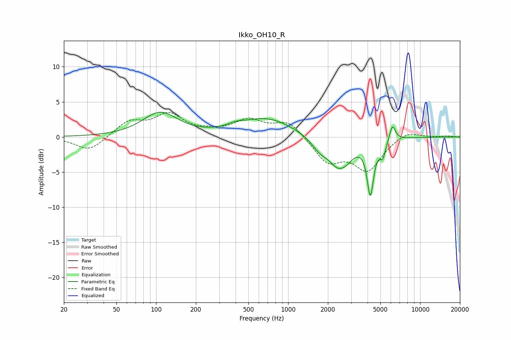

# Ikko_OH10_R
See [usage instructions](https://github.com/jaakkopasanen/AutoEq#usage) for more options and info.

### Parametric EQs
Apply preamp of -3.6 dB when using parametric equalizer.

|   # | Type    |   Fc (Hz) |    Q |   Gain (dB) |
|-----|---------|-----------|------|-------------|
|   1 | Peaking |       107 | 1.07 |         3.4 |
|   2 | Peaking |       375 | 2.21 |        -0.2 |
|   3 | Peaking |       394 | 2.19 |         0.7 |
|   4 | Peaking |       693 | 0.72 |         2.6 |
|   5 | Peaking |      1741 | 2.2  |        -1.6 |
|   6 | Peaking |      2500 | 1.91 |        -4.9 |
|   7 | Peaking |      2525 | 4.29 |         0.7 |
|   8 | Peaking |      4196 | 5.75 |        -7.4 |
|   9 | Peaking |      5203 | 6    |        -2.2 |
|  10 | Peaking |      6161 | 5.97 |         2.3 |

### Fixed Band EQs
When using fixed band (also called graphic) equalizer, apply preamp of **-3.6 dB** (if available) and set gains manually with these parameters.

|   # | Type    |   Fc (Hz) |    Q |   Gain (dB) |
|-----|---------|-----------|------|-------------|
|   1 | Peaking |        31 | 1.41 |        -2.1 |
|   2 | Peaking |        62 | 1.41 |         2.1 |
|   3 | Peaking |       125 | 1.41 |         3   |
|   4 | Peaking |       250 | 1.41 |         0.5 |
|   5 | Peaking |       500 | 1.41 |         2.2 |
|   6 | Peaking |      1000 | 1.41 |         2.3 |
|   7 | Peaking |      2000 | 1.41 |        -3.5 |
|   8 | Peaking |      4000 | 1.41 |        -4.5 |
|   9 | Peaking |      8000 | 1.41 |         1   |
|  10 | Peaking |     16000 | 1.41 |         0.1 |

### Graphs

