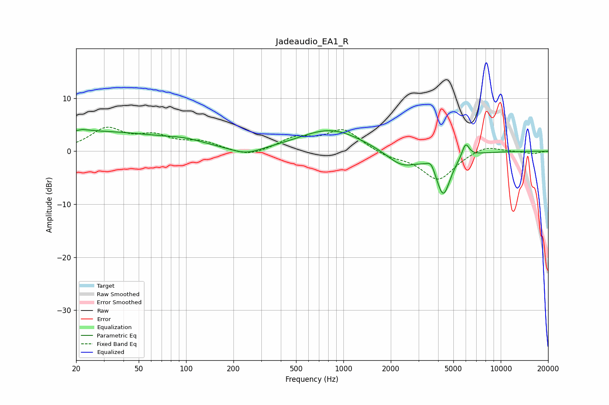

# Jadeaudio_EA1_R
See [usage instructions](https://github.com/jaakkopasanen/AutoEq#usage) for more options and info.

### Parametric EQs
Apply preamp of -4.2 dB when using parametric equalizer.

|   # | Type    |   Fc (Hz) |    Q |   Gain (dB) |
|-----|---------|-----------|------|-------------|
|   1 | Peaking |        23 | 5.65 |         3   |
|   2 | Peaking |        23 | 5.98 |        -2.7 |
|   3 | Peaking |        24 | 0.27 |         3.7 |
|   4 | Peaking |        99 | 1.15 |         0.8 |
|   5 | Peaking |       240 | 1.42 |        -1.4 |
|   6 | Peaking |       833 | 0.71 |         4.2 |
|   7 | Peaking |      2354 | 1.4  |        -3.1 |
|   8 | Peaking |      3611 | 5.59 |         1.6 |
|   9 | Peaking |      4311 | 3.02 |        -8   |
|  10 | Peaking |      5978 | 6    |         2.7 |

### Fixed Band EQs
When using fixed band (also called graphic) equalizer, apply preamp of **-4.6 dB** (if available) and set gains manually with these parameters.

|   # | Type    |   Fc (Hz) |    Q |   Gain (dB) |
|-----|---------|-----------|------|-------------|
|   1 | Peaking |        31 | 1.41 |         4   |
|   2 | Peaking |        62 | 1.41 |         2.4 |
|   3 | Peaking |       125 | 1.41 |         1.6 |
|   4 | Peaking |       250 | 1.41 |        -1.2 |
|   5 | Peaking |       500 | 1.41 |         2.3 |
|   6 | Peaking |      1000 | 1.41 |         4   |
|   7 | Peaking |      2000 | 1.41 |        -1   |
|   8 | Peaking |      4000 | 1.41 |        -5.4 |
|   9 | Peaking |      8000 | 1.41 |         1.3 |
|  10 | Peaking |     16000 | 1.41 |        -0.5 |

### Graphs

