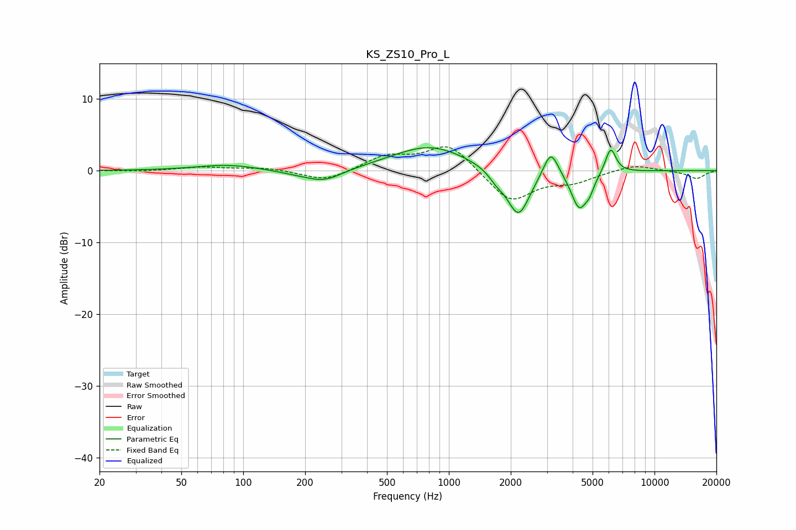

# KS_ZS10_Pro_L
See [usage instructions](https://github.com/jaakkopasanen/AutoEq#usage) for more options and info.

### Parametric EQs
Apply preamp of -3.3 dB when using parametric equalizer.

|   # | Type    |   Fc (Hz) |    Q |   Gain (dB) |
|-----|---------|-----------|------|-------------|
|   1 | Peaking |        84 | 0.93 |         0.8 |
|   2 | Peaking |       181 | 1.34 |        -0.4 |
|   3 | Peaking |       249 | 1.58 |        -1.6 |
|   4 | Peaking |       809 | 0.78 |         3.5 |
|   5 | Peaking |      1702 | 3.86 |        -1   |
|   6 | Peaking |      2179 | 2.52 |        -6.6 |
|   7 | Peaking |      3132 | 3.92 |         3.8 |
|   8 | Peaking |      4299 | 3.58 |        -5.1 |
|   9 | Peaking |      4831 | 5.99 |        -1.5 |
|  10 | Peaking |      6120 | 5.37 |         3.6 |

### Fixed Band EQs
When using fixed band (also called graphic) equalizer, apply preamp of **-3.4 dB** (if available) and set gains manually with these parameters.

|   # | Type    |   Fc (Hz) |    Q |   Gain (dB) |
|-----|---------|-----------|------|-------------|
|   1 | Peaking |        31 | 1.41 |        -0.1 |
|   2 | Peaking |        62 | 1.41 |         0.5 |
|   3 | Peaking |       125 | 1.41 |         0.4 |
|   4 | Peaking |       250 | 1.41 |        -1.5 |
|   5 | Peaking |       500 | 1.41 |         2   |
|   6 | Peaking |      1000 | 1.41 |         3.8 |
|   7 | Peaking |      2000 | 1.41 |        -4.4 |
|   8 | Peaking |      4000 | 1.41 |        -1.4 |
|   9 | Peaking |      8000 | 1.41 |         0.9 |
|  10 | Peaking |     16000 | 1.41 |        -1.1 |

### Graphs

