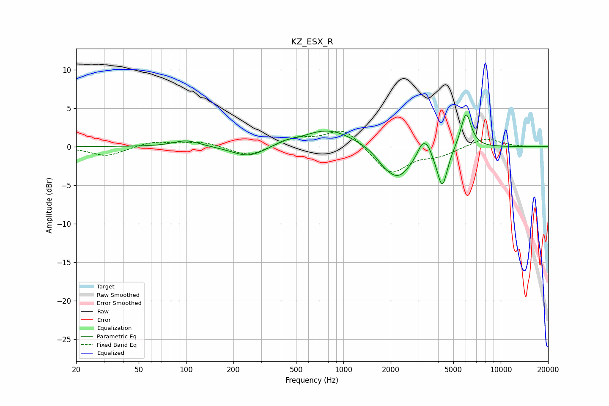

# KZ_ESX_R
See [usage instructions](https://github.com/jaakkopasanen/AutoEq#usage) for more options and info.

### Parametric EQs
Apply preamp of -4.2 dB when using parametric equalizer.

|   # | Type    |   Fc (Hz) |    Q |   Gain (dB) |
|-----|---------|-----------|------|-------------|
|   1 | Peaking |       101 | 1.7  |         0.8 |
|   2 | Peaking |       250 | 1.35 |        -1.5 |
|   3 | Peaking |       417 | 2.77 |         0.3 |
|   4 | Peaking |       806 | 0.85 |         2.4 |
|   5 | Peaking |      1795 | 3.16 |        -0.6 |
|   6 | Peaking |      2216 | 1.6  |        -4.1 |
|   7 | Peaking |      3172 | 4.42 |         1.9 |
|   8 | Peaking |      3458 | 6    |         0.9 |
|   9 | Peaking |      4252 | 4.26 |        -5.1 |
|  10 | Peaking |      6015 | 4.09 |         4.7 |

### Fixed Band EQs
When using fixed band (also called graphic) equalizer, apply preamp of **-2.1 dB** (if available) and set gains manually with these parameters.

|   # | Type    |   Fc (Hz) |    Q |   Gain (dB) |
|-----|---------|-----------|------|-------------|
|   1 | Peaking |        31 | 1.41 |        -1.3 |
|   2 | Peaking |        62 | 1.41 |         0.7 |
|   3 | Peaking |       125 | 1.41 |         0.6 |
|   4 | Peaking |       250 | 1.41 |        -1.3 |
|   5 | Peaking |       500 | 1.41 |         1.1 |
|   6 | Peaking |      1000 | 1.41 |         2.5 |
|   7 | Peaking |      2000 | 1.41 |        -3.6 |
|   8 | Peaking |      4000 | 1.41 |        -1   |
|   9 | Peaking |      8000 | 1.41 |         1.2 |
|  10 | Peaking |     16000 | 1.41 |        -0.1 |

### Graphs

