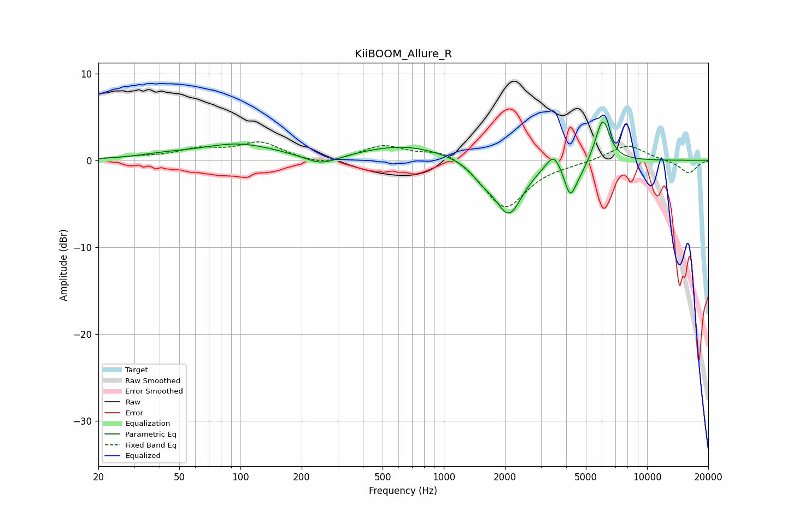

# KiiBOOM_Allure_R
See [usage instructions](https://github.com/jaakkopasanen/AutoEq#usage) for more options and info.

### Parametric EQs
Apply preamp of -4.5 dB when using parametric equalizer.

|   # | Type    |   Fc (Hz) |    Q |   Gain (dB) |
|-----|---------|-----------|------|-------------|
|   1 | Peaking |        42 | 1.18 |         0.4 |
|   2 | Peaking |        97 | 0.75 |         1.8 |
|   3 | Peaking |       251 | 1.71 |        -1.2 |
|   4 | Peaking |       647 | 0.68 |         1.7 |
|   5 | Peaking |      1550 | 2.62 |        -1.3 |
|   6 | Peaking |      2091 | 2.04 |        -6.1 |
|   7 | Peaking |      3467 | 3.97 |         1.9 |
|   8 | Peaking |      4181 | 4.79 |        -3.6 |
|   9 | Peaking |      4675 | 3.54 |        -1.1 |
|  10 | Peaking |      6048 | 3.9  |         5   |

### Fixed Band EQs
When using fixed band (also called graphic) equalizer, apply preamp of **-2.2 dB** (if available) and set gains manually with these parameters.

|   # | Type    |   Fc (Hz) |    Q |   Gain (dB) |
|-----|---------|-----------|------|-------------|
|   1 | Peaking |        31 | 1.41 |         0.3 |
|   2 | Peaking |        62 | 1.41 |         1.1 |
|   3 | Peaking |       125 | 1.41 |         2   |
|   4 | Peaking |       250 | 1.41 |        -0.7 |
|   5 | Peaking |       500 | 1.41 |         1.7 |
|   6 | Peaking |      1000 | 1.41 |         1.4 |
|   7 | Peaking |      2000 | 1.41 |        -5.6 |
|   8 | Peaking |      4000 | 1.41 |        -0.3 |
|   9 | Peaking |      8000 | 1.41 |         1.9 |
|  10 | Peaking |     16000 | 1.41 |        -1.5 |

### Graphs

