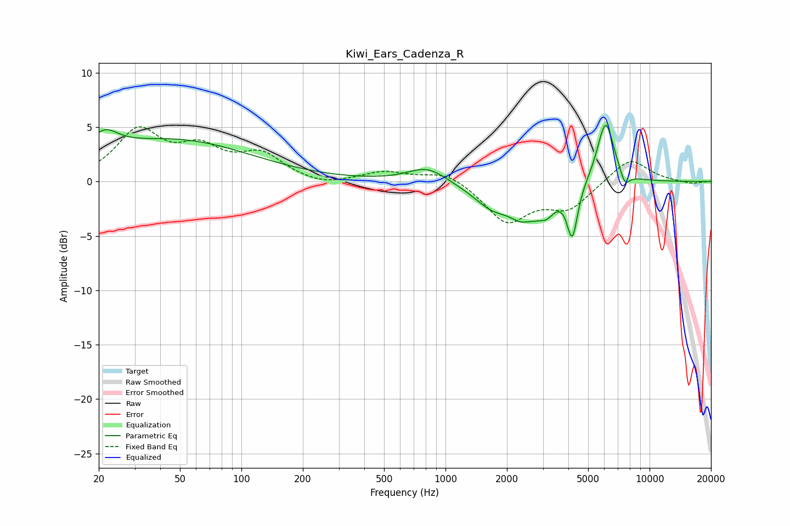

# Kiwi_Ears_Cadenza_R
See [usage instructions](https://github.com/jaakkopasanen/AutoEq#usage) for more options and info.

### Parametric EQs
Apply preamp of -5.3 dB when using parametric equalizer.

|   # | Type    |   Fc (Hz) |    Q |   Gain (dB) |
|-----|---------|-----------|------|-------------|
|   1 | Peaking |        21 | 2.03 |         2.1 |
|   2 | Peaking |        47 | 0.37 |         3.7 |
|   3 | Peaking |       812 | 1.52 |         1.4 |
|   4 | Peaking |      1716 | 1.44 |        -2.2 |
|   5 | Peaking |      2337 | 2.48 |        -1.6 |
|   6 | Peaking |      2940 | 4.04 |         1.7 |
|   7 | Peaking |      2981 | 2.84 |        -4   |
|   8 | Peaking |      4184 | 5.39 |        -4.8 |
|   9 | Peaking |      6092 | 3.31 |         5.8 |
|  10 | Peaking |      7571 | 5.65 |        -1.3 |

### Fixed Band EQs
When using fixed band (also called graphic) equalizer, apply preamp of **-5.1 dB** (if available) and set gains manually with these parameters.

|   # | Type    |   Fc (Hz) |    Q |   Gain (dB) |
|-----|---------|-----------|------|-------------|
|   1 | Peaking |        31 | 1.41 |         4.5 |
|   2 | Peaking |        62 | 1.41 |         2.6 |
|   3 | Peaking |       125 | 1.41 |         2.3 |
|   4 | Peaking |       250 | 1.41 |        -0.5 |
|   5 | Peaking |       500 | 1.41 |         0.9 |
|   6 | Peaking |      1000 | 1.41 |         1   |
|   7 | Peaking |      2000 | 1.41 |        -3.6 |
|   8 | Peaking |      4000 | 1.41 |        -2.3 |
|   9 | Peaking |      8000 | 1.41 |         2.2 |
|  10 | Peaking |     16000 | 1.41 |        -0.2 |

### Graphs

