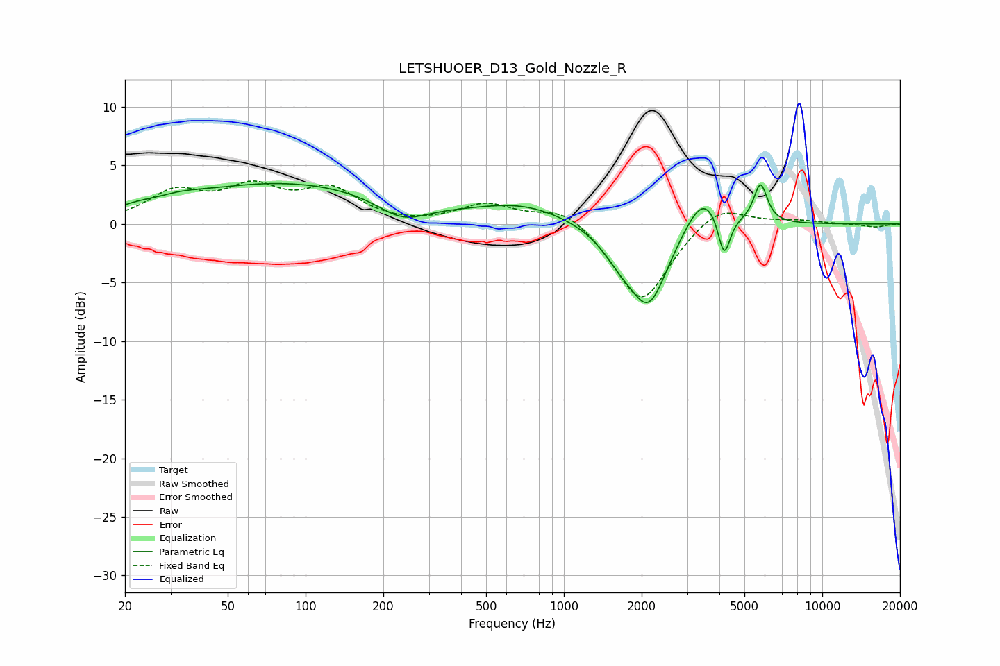

# LETSHUOER_D13_Gold_Nozzle_R
See [usage instructions](https://github.com/jaakkopasanen/AutoEq#usage) for more options and info.

### Parametric EQs
Apply preamp of -3.5 dB when using parametric equalizer.

|   # | Type    |   Fc (Hz) |    Q |   Gain (dB) |
|-----|---------|-----------|------|-------------|
|   1 | Peaking |        22 | 2.35 |         0.3 |
|   2 | Peaking |        32 | 1.52 |         0.5 |
|   3 | Peaking |        85 | 0.33 |         3.5 |
|   4 | Peaking |       237 | 1.43 |        -1.7 |
|   5 | Peaking |       697 | 0.8  |         1.5 |
|   6 | Peaking |      1642 | 1.95 |        -1.8 |
|   7 | Peaking |      2132 | 1.88 |        -6.7 |
|   8 | Peaking |      3469 | 2.01 |         3.3 |
|   9 | Peaking |      4171 | 6    |        -3.7 |
|  10 | Peaking |      5769 | 5.36 |         3.3 |

### Fixed Band EQs
When using fixed band (also called graphic) equalizer, apply preamp of **-3.8 dB** (if available) and set gains manually with these parameters.

|   # | Type    |   Fc (Hz) |    Q |   Gain (dB) |
|-----|---------|-----------|------|-------------|
|   1 | Peaking |        31 | 1.41 |         2.5 |
|   2 | Peaking |        62 | 1.41 |         2.7 |
|   3 | Peaking |       125 | 1.41 |         2.7 |
|   4 | Peaking |       250 | 1.41 |        -0.2 |
|   5 | Peaking |       500 | 1.41 |         1.6 |
|   6 | Peaking |      1000 | 1.41 |         1.6 |
|   7 | Peaking |      2000 | 1.41 |        -6.9 |
|   8 | Peaking |      4000 | 1.41 |         1.9 |
|   9 | Peaking |      8000 | 1.41 |         0.3 |
|  10 | Peaking |     16000 | 1.41 |        -0.3 |

### Graphs

