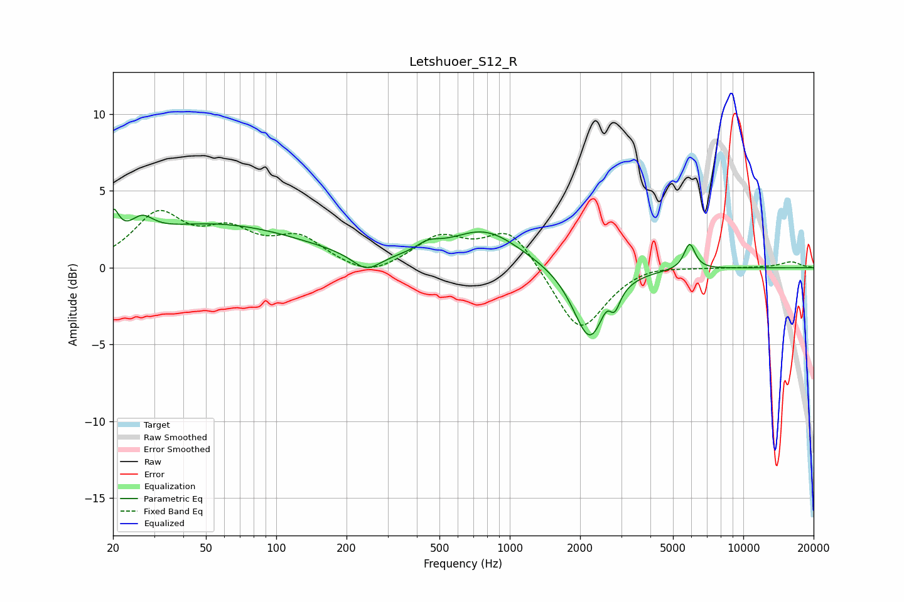

# Letshuoer_S12_R
See [usage instructions](https://github.com/jaakkopasanen/AutoEq#usage) for more options and info.

### Parametric EQs
Apply preamp of -3.9 dB when using parametric equalizer.

|   # | Type    |   Fc (Hz) |    Q |   Gain (dB) |
|-----|---------|-----------|------|-------------|
|   1 | Peaking |        20 | 5.81 |         1.9 |
|   2 | Peaking |        27 | 2.88 |         1.2 |
|   3 | Peaking |        54 | 0.37 |         2.8 |
|   4 | Peaking |       243 | 2.36 |        -1.1 |
|   5 | Peaking |       447 | 2.78 |         0.6 |
|   6 | Peaking |       780 | 0.91 |         2.4 |
|   7 | Peaking |      2211 | 1.99 |        -5   |
|   8 | Peaking |      2641 | 4.15 |         1.1 |
|   9 | Peaking |      2800 | 5.97 |        -1.5 |
|  10 | Peaking |      5889 | 5.9  |         1.7 |

### Fixed Band EQs
When using fixed band (also called graphic) equalizer, apply preamp of **-3.8 dB** (if available) and set gains manually with these parameters.

|   # | Type    |   Fc (Hz) |    Q |   Gain (dB) |
|-----|---------|-----------|------|-------------|
|   1 | Peaking |        31 | 1.41 |         3.3 |
|   2 | Peaking |        62 | 1.41 |         2   |
|   3 | Peaking |       125 | 1.41 |         1.8 |
|   4 | Peaking |       250 | 1.41 |        -0.8 |
|   5 | Peaking |       500 | 1.41 |         1.9 |
|   6 | Peaking |      1000 | 1.41 |         2.6 |
|   7 | Peaking |      2000 | 1.41 |        -4.3 |
|   8 | Peaking |      4000 | 1.41 |         0.3 |
|   9 | Peaking |      8000 | 1.41 |         0   |
|  10 | Peaking |     16000 | 1.41 |         0.4 |

### Graphs

