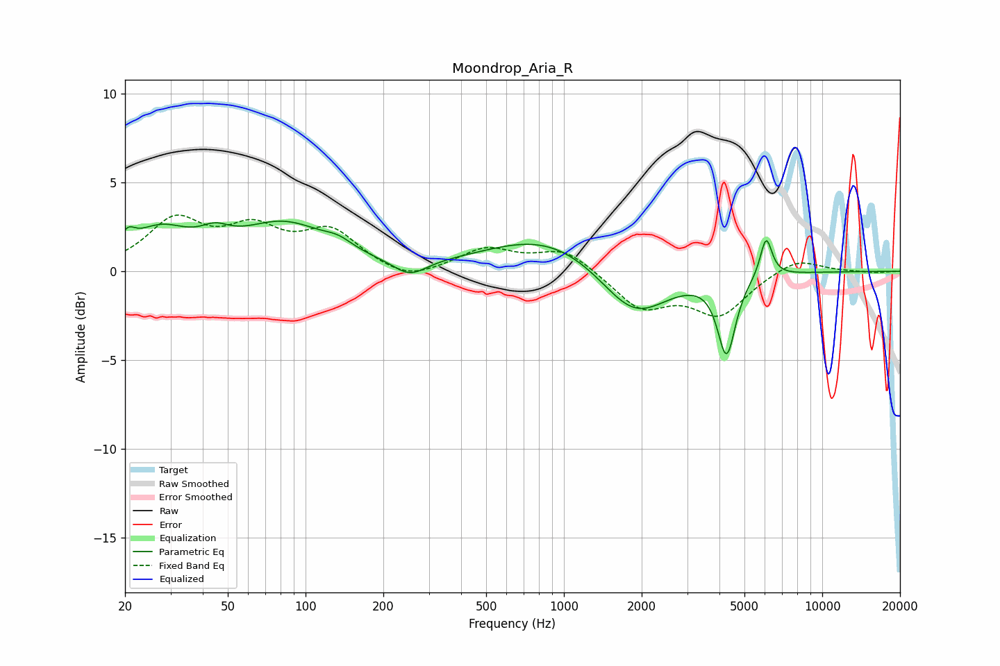

# Moondrop_Aria_R
See [usage instructions](https://github.com/jaakkopasanen/AutoEq#usage) for more options and info.

### Parametric EQs
Apply preamp of -2.9 dB when using parametric equalizer.

|   # | Type    |   Fc (Hz) |    Q |   Gain (dB) |
|-----|---------|-----------|------|-------------|
|   1 | Peaking |        20 | 5.18 |         0.8 |
|   2 | Peaking |        27 | 1.25 |         2   |
|   3 | Peaking |        45 | 2.48 |         0.8 |
|   4 | Peaking |        83 | 0.81 |         2.5 |
|   5 | Peaking |       134 | 2.66 |         0.4 |
|   6 | Peaking |       253 | 2.14 |        -0.9 |
|   7 | Peaking |       868 | 0.61 |         2.1 |
|   8 | Peaking |      1871 | 1.07 |        -3   |
|   9 | Peaking |      4263 | 4.1  |        -4.4 |
|  10 | Peaking |      6063 | 6    |         2.3 |

### Fixed Band EQs
When using fixed band (also called graphic) equalizer, apply preamp of **-3.3 dB** (if available) and set gains manually with these parameters.

|   # | Type    |   Fc (Hz) |    Q |   Gain (dB) |
|-----|---------|-----------|------|-------------|
|   1 | Peaking |        31 | 1.41 |         2.7 |
|   2 | Peaking |        62 | 1.41 |         2   |
|   3 | Peaking |       125 | 1.41 |         2.1 |
|   4 | Peaking |       250 | 1.41 |        -0.7 |
|   5 | Peaking |       500 | 1.41 |         1.2 |
|   6 | Peaking |      1000 | 1.41 |         1.3 |
|   7 | Peaking |      2000 | 1.41 |        -2   |
|   8 | Peaking |      4000 | 1.41 |        -2.3 |
|   9 | Peaking |      8000 | 1.41 |         0.8 |
|  10 | Peaking |     16000 | 1.41 |        -0.1 |

### Graphs

