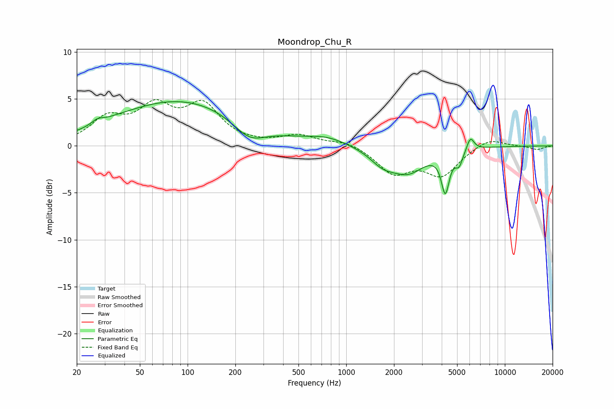

# Moondrop_Chu_R
See [usage instructions](https://github.com/jaakkopasanen/AutoEq#usage) for more options and info.

### Parametric EQs
Apply preamp of -4.8 dB when using parametric equalizer.

|   # | Type    |   Fc (Hz) |    Q |   Gain (dB) |
|-----|---------|-----------|------|-------------|
|   1 | Peaking |        27 | 3.86 |         0.5 |
|   2 | Peaking |        35 | 1.44 |         0.2 |
|   3 | Peaking |        91 | 0.34 |         4.9 |
|   4 | Peaking |       245 | 1.36 |        -2   |
|   5 | Peaking |       756 | 1.16 |         0.8 |
|   6 | Peaking |      1695 | 1.76 |        -1.4 |
|   7 | Peaking |      2448 | 1.31 |        -2.6 |
|   8 | Peaking |      4214 | 5.72 |        -4.2 |
|   9 | Peaking |      5141 | 5.9  |        -1.5 |
|  10 | Peaking |      6069 | 5.93 |         1.4 |

### Fixed Band EQs
When using fixed band (also called graphic) equalizer, apply preamp of **-5.0 dB** (if available) and set gains manually with these parameters.

|   # | Type    |   Fc (Hz) |    Q |   Gain (dB) |
|-----|---------|-----------|------|-------------|
|   1 | Peaking |        31 | 1.41 |         2.7 |
|   2 | Peaking |        62 | 1.41 |         3.7 |
|   3 | Peaking |       125 | 1.41 |         4   |
|   4 | Peaking |       250 | 1.41 |         0.1 |
|   5 | Peaking |       500 | 1.41 |         1.1 |
|   6 | Peaking |      1000 | 1.41 |         0.6 |
|   7 | Peaking |      2000 | 1.41 |        -2.8 |
|   8 | Peaking |      4000 | 1.41 |        -3   |
|   9 | Peaking |      8000 | 1.41 |         0.9 |
|  10 | Peaking |     16000 | 1.41 |        -0.4 |

### Graphs

