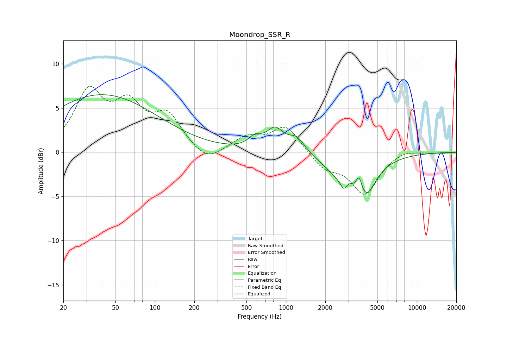

# Moondrop_SSR_R
See [usage instructions](https://github.com/jaakkopasanen/AutoEq#usage) for more options and info.

### Parametric EQs
Apply preamp of -6.6 dB when using parametric equalizer.

|   # | Type    |   Fc (Hz) |    Q |   Gain (dB) |
|-----|---------|-----------|------|-------------|
|   1 | Peaking |        39 | 0.33 |         6.5 |
|   2 | Peaking |       581 | 2.85 |         1.1 |
|   3 | Peaking |       826 | 2.17 |         2.4 |
|   4 | Peaking |      1213 | 2.24 |         1.7 |
|   5 | Peaking |      2764 | 5.93 |        -1.1 |
|   6 | Peaking |      2929 | 2.34 |         0.7 |
|   7 | Peaking |      3050 | 2.71 |         1.3 |
|   8 | Peaking |      3163 | 1.12 |        -4.9 |
|   9 | Peaking |      3619 | 6    |         2   |
|  10 | Peaking |      4143 | 2.3  |        -2.1 |

### Fixed Band EQs
When using fixed band (also called graphic) equalizer, apply preamp of **-7.6 dB** (if available) and set gains manually with these parameters.

|   # | Type    |   Fc (Hz) |    Q |   Gain (dB) |
|-----|---------|-----------|------|-------------|
|   1 | Peaking |        31 | 1.41 |         6.5 |
|   2 | Peaking |        62 | 1.41 |         4.6 |
|   3 | Peaking |       125 | 1.41 |         3.8 |
|   4 | Peaking |       250 | 1.41 |        -1.4 |
|   5 | Peaking |       500 | 1.41 |         1.6 |
|   6 | Peaking |      1000 | 1.41 |         3   |
|   7 | Peaking |      2000 | 1.41 |        -1.8 |
|   8 | Peaking |      4000 | 1.41 |        -4.6 |
|   9 | Peaking |      8000 | 1.41 |         0.5 |
|  10 | Peaking |     16000 | 1.41 |        -0.1 |

### Graphs

