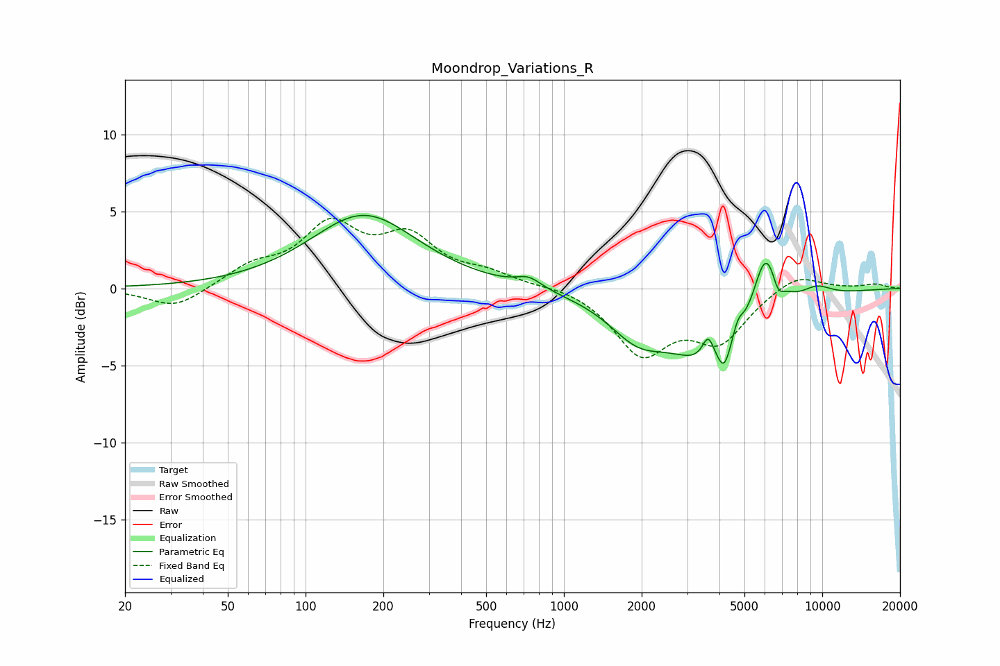

# Moondrop_Variations_R
See [usage instructions](https://github.com/jaakkopasanen/AutoEq#usage) for more options and info.

### Parametric EQs
Apply preamp of -4.8 dB when using parametric equalizer.

|   # | Type    |   Fc (Hz) |    Q |   Gain (dB) |
|-----|---------|-----------|------|-------------|
|   1 | Peaking |       168 | 0.69 |         4.8 |
|   2 | Peaking |       732 | 2.91 |         0.7 |
|   3 | Peaking |      1920 | 1.29 |        -2.2 |
|   4 | Peaking |      3623 | 5.95 |         1.7 |
|   5 | Peaking |      4011 | 0.79 |        -5.1 |
|   6 | Peaking |      4174 | 6    |        -1.3 |
|   7 | Peaking |      4712 | 6    |         1.3 |
|   8 | Peaking |      6038 | 2.54 |         5.2 |
|   9 | Peaking |      6729 | 6    |        -1.1 |
|  10 | Peaking |      9482 | 2.01 |         0.8 |

### Fixed Band EQs
When using fixed band (also called graphic) equalizer, apply preamp of **-4.7 dB** (if available) and set gains manually with these parameters.

|   # | Type    |   Fc (Hz) |    Q |   Gain (dB) |
|-----|---------|-----------|------|-------------|
|   1 | Peaking |        31 | 1.41 |        -1.3 |
|   2 | Peaking |        62 | 1.41 |         1.2 |
|   3 | Peaking |       125 | 1.41 |         3.8 |
|   4 | Peaking |       250 | 1.41 |         3   |
|   5 | Peaking |       500 | 1.41 |         0.8 |
|   6 | Peaking |      1000 | 1.41 |         0.2 |
|   7 | Peaking |      2000 | 1.41 |        -4.1 |
|   8 | Peaking |      4000 | 1.41 |        -3.2 |
|   9 | Peaking |      8000 | 1.41 |         1.1 |
|  10 | Peaking |     16000 | 1.41 |         0.3 |

### Graphs

