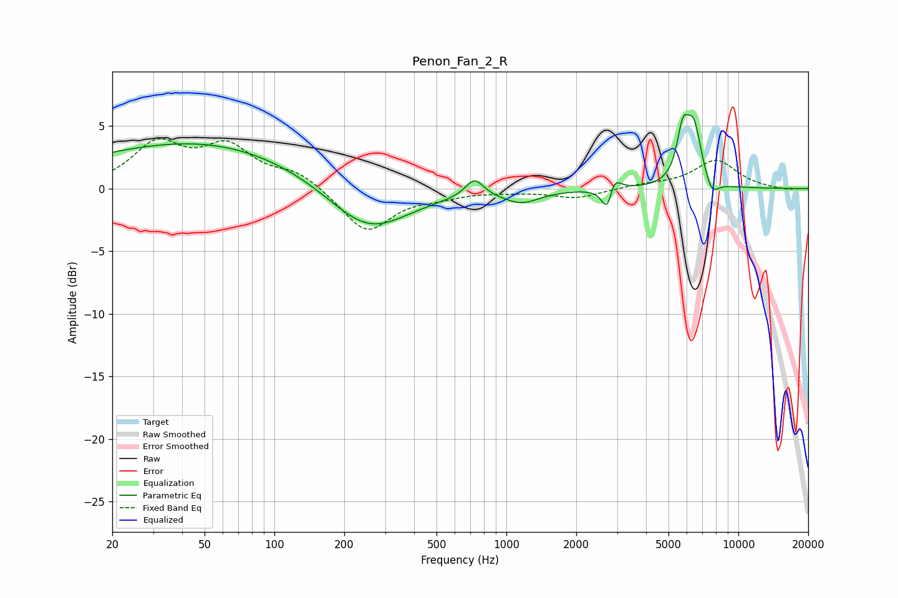

# Penon_Fan_2_R
See [usage instructions](https://github.com/jaakkopasanen/AutoEq#usage) for more options and info.

### Parametric EQs
Apply preamp of -6.0 dB when using parametric equalizer.

|   # | Type    |   Fc (Hz) |    Q |   Gain (dB) |
|-----|---------|-----------|------|-------------|
|   1 | Peaking |        33 | 0.31 |         2.7 |
|   2 | Peaking |        88 | 0.36 |         1.4 |
|   3 | Peaking |       253 | 0.8  |        -4   |
|   4 | Peaking |       728 | 3.66 |         1.4 |
|   5 | Peaking |      1161 | 1.76 |        -1   |
|   6 | Peaking |      2752 | 5.5  |        -3.3 |
|   7 | Peaking |      2864 | 5.17 |         2.6 |
|   8 | Peaking |      5756 | 5.58 |         3.4 |
|   9 | Peaking |      6422 | 3.99 |         4.7 |
|  10 | Peaking |      7655 | 4.41 |        -1.4 |

### Fixed Band EQs
When using fixed band (also called graphic) equalizer, apply preamp of **-4.1 dB** (if available) and set gains manually with these parameters.

|   # | Type    |   Fc (Hz) |    Q |   Gain (dB) |
|-----|---------|-----------|------|-------------|
|   1 | Peaking |        31 | 1.41 |         3.4 |
|   2 | Peaking |        62 | 1.41 |         3.1 |
|   3 | Peaking |       125 | 1.41 |         1.2 |
|   4 | Peaking |       250 | 1.41 |        -3.5 |
|   5 | Peaking |       500 | 1.41 |        -0.5 |
|   6 | Peaking |      1000 | 1.41 |        -0.2 |
|   7 | Peaking |      2000 | 1.41 |        -0.7 |
|   8 | Peaking |      4000 | 1.41 |         0.3 |
|   9 | Peaking |      8000 | 1.41 |         2.2 |
|  10 | Peaking |     16000 | 1.41 |        -0.1 |

### Graphs

