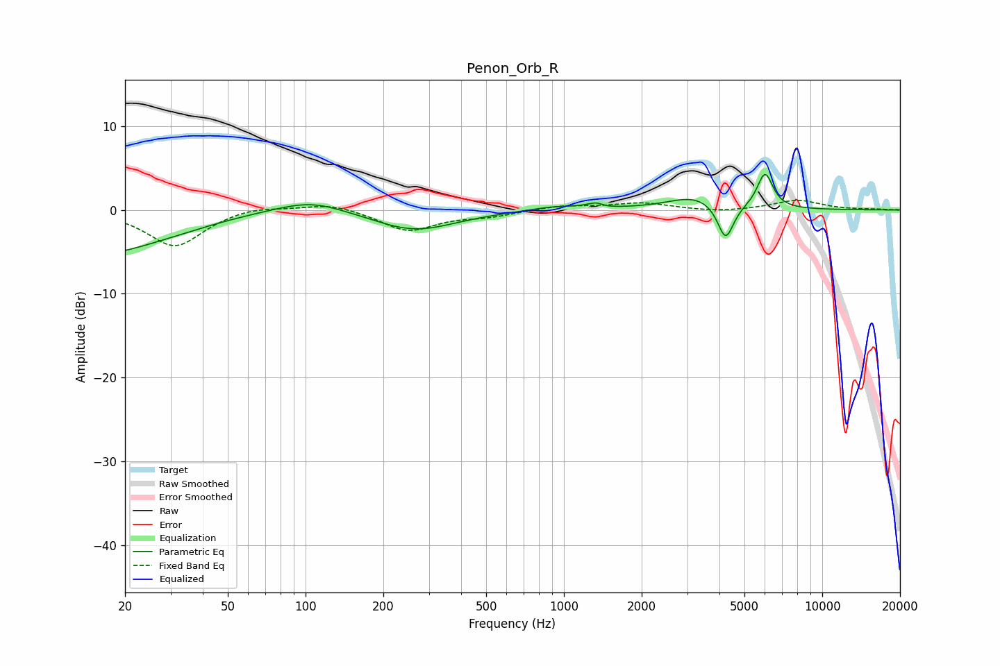

# Penon_Orb_R
See [usage instructions](https://github.com/jaakkopasanen/AutoEq#usage) for more options and info.

### Parametric EQs
Apply preamp of -4.4 dB when using parametric equalizer.

|   # | Type    |   Fc (Hz) |    Q |   Gain (dB) |
|-----|---------|-----------|------|-------------|
|   1 | Peaking |        31 | 0.18 |        -9.5 |
|   2 | Peaking |        62 | 0.32 |         7.9 |
|   3 | Peaking |       105 | 1.12 |         1.3 |
|   4 | Peaking |       263 | 0.87 |        -2.6 |
|   5 | Peaking |       932 | 1.37 |         0.5 |
|   6 | Peaking |      1337 | 4.21 |         0.6 |
|   7 | Peaking |      1450 | 5.14 |        -0.2 |
|   8 | Peaking |      3211 | 1.37 |         1.6 |
|   9 | Peaking |      4227 | 4.57 |        -4.4 |
|  10 | Peaking |      6004 | 4.55 |         4.3 |

### Fixed Band EQs
When using fixed band (also called graphic) equalizer, apply preamp of **-1.2 dB** (if available) and set gains manually with these parameters.

|   # | Type    |   Fc (Hz) |    Q |   Gain (dB) |
|-----|---------|-----------|------|-------------|
|   1 | Peaking |        31 | 1.41 |        -4.4 |
|   2 | Peaking |        62 | 1.41 |         0.6 |
|   3 | Peaking |       125 | 1.41 |         0.9 |
|   4 | Peaking |       250 | 1.41 |        -2.5 |
|   5 | Peaking |       500 | 1.41 |        -0.7 |
|   6 | Peaking |      1000 | 1.41 |         0.5 |
|   7 | Peaking |      2000 | 1.41 |         0.8 |
|   8 | Peaking |      4000 | 1.41 |        -0.3 |
|   9 | Peaking |      8000 | 1.41 |         1.2 |
|  10 | Peaking |     16000 | 1.41 |         0.1 |

### Graphs

