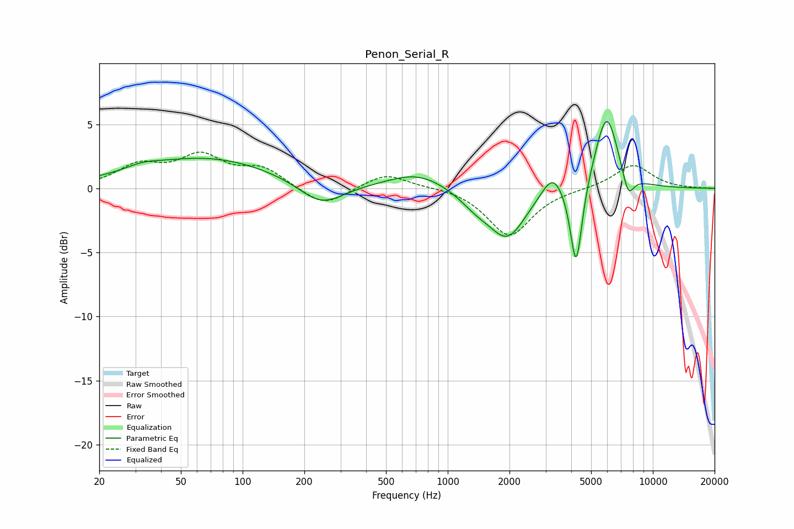

# Penon_Serial_R
See [usage instructions](https://github.com/jaakkopasanen/AutoEq#usage) for more options and info.

### Parametric EQs
Apply preamp of -5.3 dB when using parametric equalizer.

|   # | Type    |   Fc (Hz) |    Q |   Gain (dB) |
|-----|---------|-----------|------|-------------|
|   1 | Peaking |        32 | 1.81 |         0.4 |
|   2 | Peaking |        66 | 0.42 |         2.4 |
|   3 | Peaking |       241 | 1.31 |        -1.8 |
|   4 | Peaking |       713 | 0.97 |         1.3 |
|   5 | Peaking |      1369 | 1.72 |        -1   |
|   6 | Peaking |      1955 | 1.56 |        -3.7 |
|   7 | Peaking |      3249 | 2.7  |         1.8 |
|   8 | Peaking |      4228 | 4.84 |        -6.9 |
|   9 | Peaking |      5945 | 2.4  |         6   |
|  10 | Peaking |      7574 | 4.61 |        -2   |

### Fixed Band EQs
When using fixed band (also called graphic) equalizer, apply preamp of **-2.9 dB** (if available) and set gains manually with these parameters.

|   # | Type    |   Fc (Hz) |    Q |   Gain (dB) |
|-----|---------|-----------|------|-------------|
|   1 | Peaking |        31 | 1.41 |         1.6 |
|   2 | Peaking |        62 | 1.41 |         2.3 |
|   3 | Peaking |       125 | 1.41 |         1.4 |
|   4 | Peaking |       250 | 1.41 |        -1.5 |
|   5 | Peaking |       500 | 1.41 |         1.2 |
|   6 | Peaking |      1000 | 1.41 |         0.1 |
|   7 | Peaking |      2000 | 1.41 |        -3.7 |
|   8 | Peaking |      4000 | 1.41 |        -0   |
|   9 | Peaking |      8000 | 1.41 |         1.9 |
|  10 | Peaking |     16000 | 1.41 |        -0   |

### Graphs

