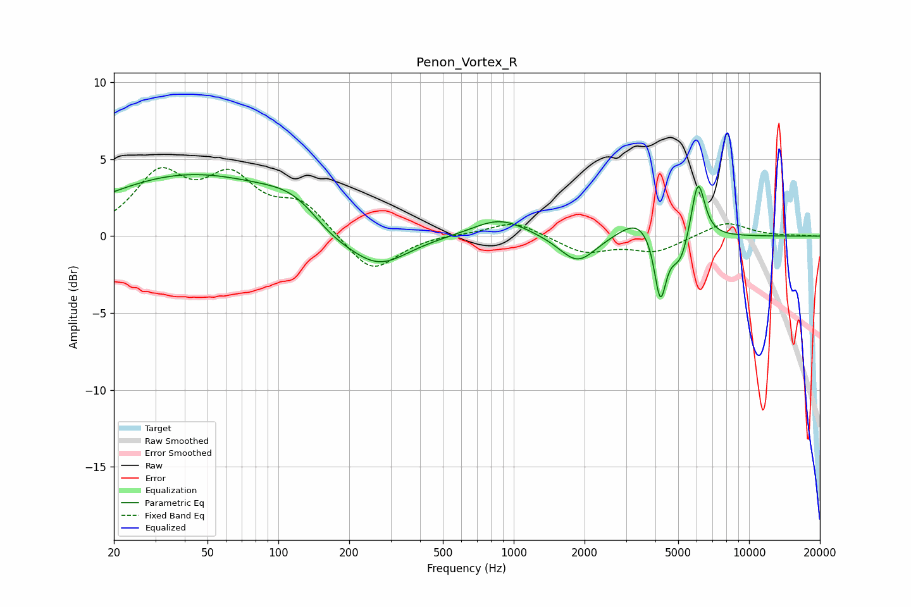

# Penon_Vortex_R
See [usage instructions](https://github.com/jaakkopasanen/AutoEq#usage) for more options and info.

### Parametric EQs
Apply preamp of -4.1 dB when using parametric equalizer.

|   # | Type    |   Fc (Hz) |    Q |   Gain (dB) |
|-----|---------|-----------|------|-------------|
|   1 | Peaking |        42 | 0.37 |         3.9 |
|   2 | Peaking |       120 | 1.06 |         1.5 |
|   3 | Peaking |       165 | 1.28 |        -1.1 |
|   4 | Peaking |       265 | 1.1  |        -2.3 |
|   5 | Peaking |       873 | 1.23 |         1.2 |
|   6 | Peaking |      1870 | 1.82 |        -1.8 |
|   7 | Peaking |      3386 | 1.79 |         1.3 |
|   8 | Peaking |      4196 | 5.64 |        -4.3 |
|   9 | Peaking |      5097 | 3.46 |        -2   |
|  10 | Peaking |      6062 | 4.74 |         4   |

### Fixed Band EQs
When using fixed band (also called graphic) equalizer, apply preamp of **-4.6 dB** (if available) and set gains manually with these parameters.

|   # | Type    |   Fc (Hz) |    Q |   Gain (dB) |
|-----|---------|-----------|------|-------------|
|   1 | Peaking |        31 | 1.41 |         3.8 |
|   2 | Peaking |        62 | 1.41 |         3.4 |
|   3 | Peaking |       125 | 1.41 |         2   |
|   4 | Peaking |       250 | 1.41 |        -2.5 |
|   5 | Peaking |       500 | 1.41 |         0.1 |
|   6 | Peaking |      1000 | 1.41 |         1   |
|   7 | Peaking |      2000 | 1.41 |        -1.1 |
|   8 | Peaking |      4000 | 1.41 |        -1   |
|   9 | Peaking |      8000 | 1.41 |         1   |
|  10 | Peaking |     16000 | 1.41 |         0   |

### Graphs

