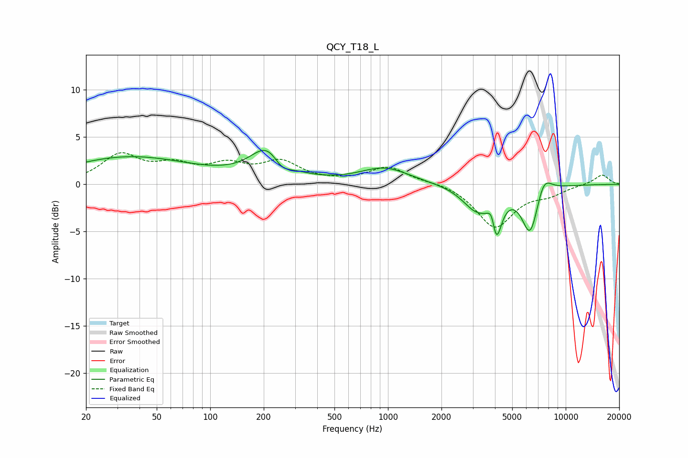

# QCY_T18_L
See [usage instructions](https://github.com/jaakkopasanen/AutoEq#usage) for more options and info.

### Parametric EQs
Apply preamp of -3.7 dB when using parametric equalizer.

|   # | Type    |   Fc (Hz) |    Q |   Gain (dB) |
|-----|---------|-----------|------|-------------|
|   1 | Peaking |        35 | 0.41 |         2.6 |
|   2 | Peaking |        51 | 0.25 |         0.3 |
|   3 | Peaking |       213 | 1.47 |         3.7 |
|   4 | Peaking |       251 | 2.67 |        -1.5 |
|   5 | Peaking |       960 | 1.02 |         1.7 |
|   6 | Peaking |      3140 | 1.77 |        -2.4 |
|   7 | Peaking |      3866 | 5.92 |         3.2 |
|   8 | Peaking |      4025 | 4.62 |        -6   |
|   9 | Peaking |      6318 | 2.92 |        -5.2 |
|  10 | Peaking |      7510 | 3.1  |         2.1 |

### Fixed Band EQs
When using fixed band (also called graphic) equalizer, apply preamp of **-3.4 dB** (if available) and set gains manually with these parameters.

|   # | Type    |   Fc (Hz) |    Q |   Gain (dB) |
|-----|---------|-----------|------|-------------|
|   1 | Peaking |        31 | 1.41 |         2.9 |
|   2 | Peaking |        62 | 1.41 |         1.7 |
|   3 | Peaking |       125 | 1.41 |         1.7 |
|   4 | Peaking |       250 | 1.41 |         2.2 |
|   5 | Peaking |       500 | 1.41 |         0.1 |
|   6 | Peaking |      1000 | 1.41 |         1.8 |
|   7 | Peaking |      2000 | 1.41 |         0.3 |
|   8 | Peaking |      4000 | 1.41 |        -4.5 |
|   9 | Peaking |      8000 | 1.41 |        -0.9 |
|  10 | Peaking |     16000 | 1.41 |         1.1 |

### Graphs

