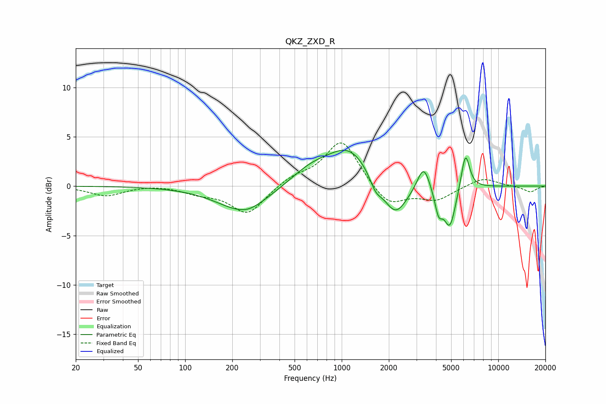

# QKZ_ZXD_R
See [usage instructions](https://github.com/jaakkopasanen/AutoEq#usage) for more options and info.

### Parametric EQs
Apply preamp of -3.7 dB when using parametric equalizer.

|   # | Type    |   Fc (Hz) |    Q |   Gain (dB) |
|-----|---------|-----------|------|-------------|
|   1 | Peaking |       237 | 0.84 |        -2.6 |
|   2 | Peaking |       254 | 2.39 |        -0.2 |
|   3 | Peaking |       635 | 1.03 |         1.5 |
|   4 | Peaking |      1119 | 1.02 |         3.6 |
|   5 | Peaking |      1647 | 3.63 |        -1.3 |
|   6 | Peaking |      2196 | 1.84 |        -3.5 |
|   7 | Peaking |      3334 | 3.58 |         2.6 |
|   8 | Peaking |      4157 | 5.64 |        -2.3 |
|   9 | Peaking |      4908 | 3.67 |        -4.1 |
|  10 | Peaking |      6167 | 5.05 |         3.8 |

### Fixed Band EQs
When using fixed band (also called graphic) equalizer, apply preamp of **-4.5 dB** (if available) and set gains manually with these parameters.

|   # | Type    |   Fc (Hz) |    Q |   Gain (dB) |
|-----|---------|-----------|------|-------------|
|   1 | Peaking |        31 | 1.41 |        -1   |
|   2 | Peaking |        62 | 1.41 |         0.2 |
|   3 | Peaking |       125 | 1.41 |        -0.6 |
|   4 | Peaking |       250 | 1.41 |        -2.8 |
|   5 | Peaking |       500 | 1.41 |         0.9 |
|   6 | Peaking |      1000 | 1.41 |         4.7 |
|   7 | Peaking |      2000 | 1.41 |        -2.1 |
|   8 | Peaking |      4000 | 1.41 |        -1.3 |
|   9 | Peaking |      8000 | 1.41 |         0.9 |
|  10 | Peaking |     16000 | 1.41 |        -0.6 |

### Graphs

