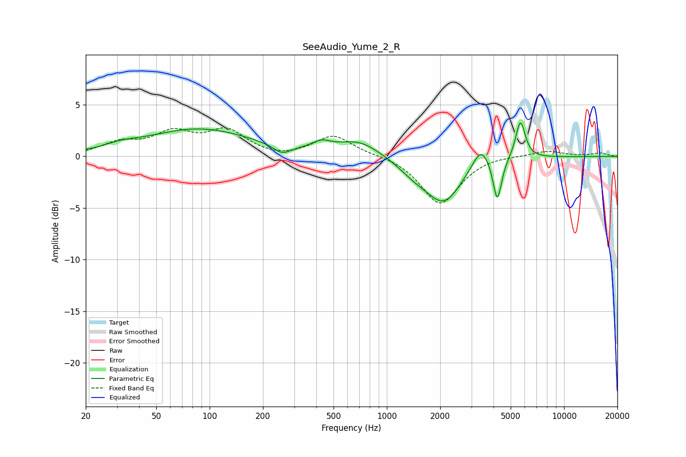

# SeeAudio_Yume_2_R
See [usage instructions](https://github.com/jaakkopasanen/AutoEq#usage) for more options and info.

### Parametric EQs
Apply preamp of -3.3 dB when using parametric equalizer.

|   # | Type    |   Fc (Hz) |    Q |   Gain (dB) |
|-----|---------|-----------|------|-------------|
|   1 | Peaking |        31 | 1.61 |         0.4 |
|   2 | Peaking |        87 | 0.47 |         2.6 |
|   3 | Peaking |       256 | 2.83 |        -0.9 |
|   4 | Peaking |       426 | 2.71 |         0.7 |
|   5 | Peaking |       698 | 1.15 |         1.5 |
|   6 | Peaking |      1430 | 1.49 |        -1.1 |
|   7 | Peaking |      2101 | 1.38 |        -4.2 |
|   8 | Peaking |      3392 | 3    |         2   |
|   9 | Peaking |      4202 | 5.93 |        -4.2 |
|  10 | Peaking |      5672 | 5.17 |         3.7 |

### Fixed Band EQs
When using fixed band (also called graphic) equalizer, apply preamp of **-2.9 dB** (if available) and set gains manually with these parameters.

|   # | Type    |   Fc (Hz) |    Q |   Gain (dB) |
|-----|---------|-----------|------|-------------|
|   1 | Peaking |        31 | 1.41 |         1.2 |
|   2 | Peaking |        62 | 1.41 |         2.1 |
|   3 | Peaking |       125 | 1.41 |         2.3 |
|   4 | Peaking |       250 | 1.41 |        -0.3 |
|   5 | Peaking |       500 | 1.41 |         2   |
|   6 | Peaking |      1000 | 1.41 |         0.1 |
|   7 | Peaking |      2000 | 1.41 |        -4.7 |
|   8 | Peaking |      4000 | 1.41 |         0.2 |
|   9 | Peaking |      8000 | 1.41 |         0.6 |
|  10 | Peaking |     16000 | 1.41 |         0.3 |

### Graphs

