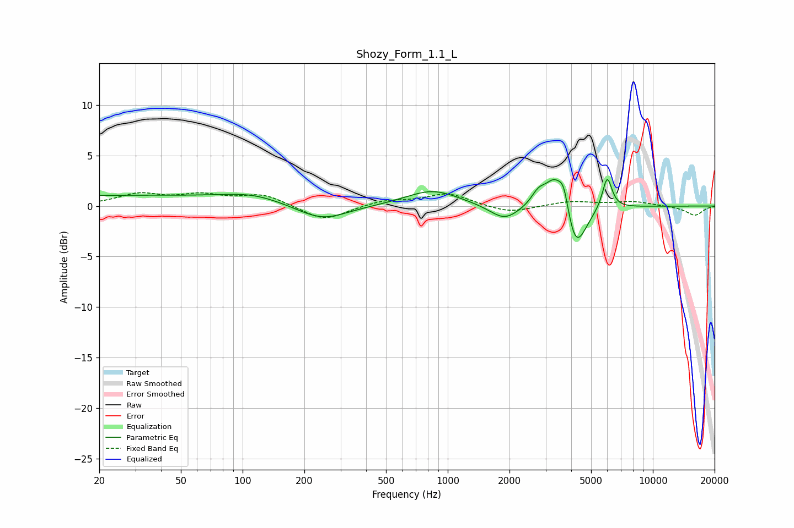

# Shozy_Form_1.1_L
See [usage instructions](https://github.com/jaakkopasanen/AutoEq#usage) for more options and info.

### Parametric EQs
Apply preamp of -2.7 dB when using parametric equalizer.

|   # | Type    |   Fc (Hz) |    Q |   Gain (dB) |
|-----|---------|-----------|------|-------------|
|   1 | Peaking |        24 | 0.18 |         1   |
|   2 | Peaking |       112 | 0.97 |         0.7 |
|   3 | Peaking |       244 | 1.13 |        -1.6 |
|   4 | Peaking |       842 | 1.1  |         1.6 |
|   5 | Peaking |      1891 | 1.99 |        -1.5 |
|   6 | Peaking |      2768 | 4.01 |         1.3 |
|   7 | Peaking |      3311 | 3.03 |         3   |
|   8 | Peaking |      3683 | 5.8  |         2.4 |
|   9 | Peaking |      4202 | 2.76 |        -4.7 |
|  10 | Peaking |      5988 | 5.92 |         3.2 |

### Fixed Band EQs
When using fixed band (also called graphic) equalizer, apply preamp of **-1.4 dB** (if available) and set gains manually with these parameters.

|   # | Type    |   Fc (Hz) |    Q |   Gain (dB) |
|-----|---------|-----------|------|-------------|
|   1 | Peaking |        31 | 1.41 |         1.1 |
|   2 | Peaking |        62 | 1.41 |         1   |
|   3 | Peaking |       125 | 1.41 |         1.1 |
|   4 | Peaking |       250 | 1.41 |        -1.5 |
|   5 | Peaking |       500 | 1.41 |         0.5 |
|   6 | Peaking |      1000 | 1.41 |         1.2 |
|   7 | Peaking |      2000 | 1.41 |        -0.7 |
|   8 | Peaking |      4000 | 1.41 |         0.5 |
|   9 | Peaking |      8000 | 1.41 |         0.4 |
|  10 | Peaking |     16000 | 1.41 |        -0.9 |

### Graphs

