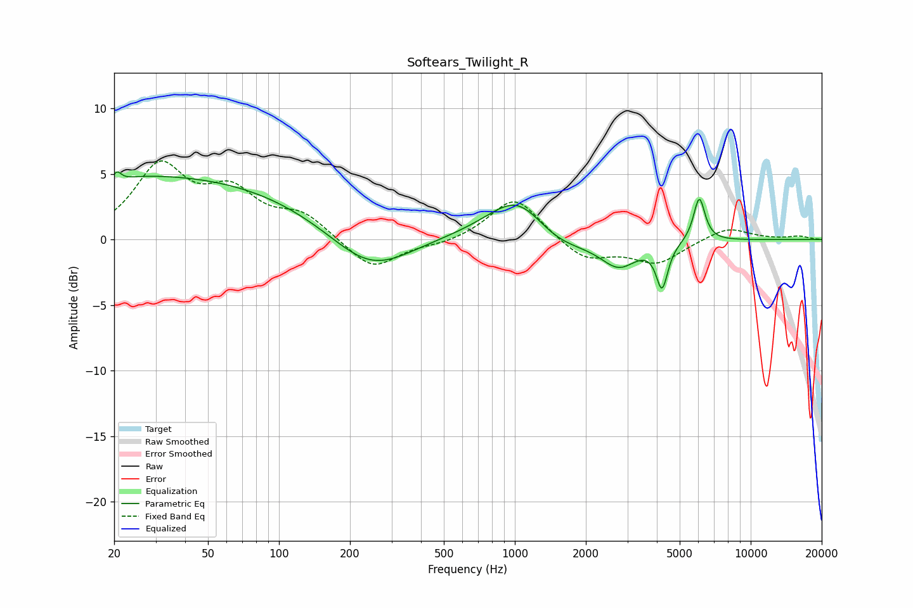

# Softears_Twilight_R
See [usage instructions](https://github.com/jaakkopasanen/AutoEq#usage) for more options and info.

### Parametric EQs
Apply preamp of -5.2 dB when using parametric equalizer.

|   # | Type    |   Fc (Hz) |    Q |   Gain (dB) |
|-----|---------|-----------|------|-------------|
|   1 | Peaking |        20 | 4.75 |        -3.1 |
|   2 | Peaking |        20 | 5.94 |         3.2 |
|   3 | Peaking |        26 | 0.18 |         4.9 |
|   4 | Peaking |       244 | 0.82 |        -3.3 |
|   5 | Peaking |       423 | 0.23 |         0.3 |
|   6 | Peaking |      1056 | 1.06 |         4.3 |
|   7 | Peaking |      1394 | 0.94 |        -2.3 |
|   8 | Peaking |      2759 | 1.86 |        -2   |
|   9 | Peaking |      4209 | 5.74 |        -3.4 |
|  10 | Peaking |      6052 | 5.69 |         3.4 |

### Fixed Band EQs
When using fixed band (also called graphic) equalizer, apply preamp of **-6.1 dB** (if available) and set gains manually with these parameters.

|   # | Type    |   Fc (Hz) |    Q |   Gain (dB) |
|-----|---------|-----------|------|-------------|
|   1 | Peaking |        31 | 1.41 |         5.3 |
|   2 | Peaking |        62 | 1.41 |         3.2 |
|   3 | Peaking |       125 | 1.41 |         1.7 |
|   4 | Peaking |       250 | 1.41 |        -2.4 |
|   5 | Peaking |       500 | 1.41 |        -0.4 |
|   6 | Peaking |      1000 | 1.41 |         3.3 |
|   7 | Peaking |      2000 | 1.41 |        -1.6 |
|   8 | Peaking |      4000 | 1.41 |        -1.8 |
|   9 | Peaking |      8000 | 1.41 |         1   |
|  10 | Peaking |     16000 | 1.41 |         0.2 |

### Graphs

