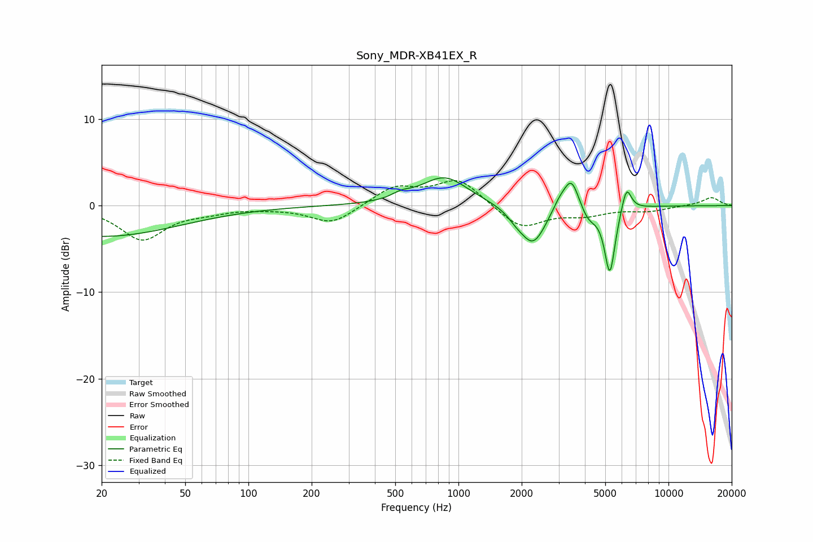

# Sony_MDR-XB41EX_R
See [usage instructions](https://github.com/jaakkopasanen/AutoEq#usage) for more options and info.

### Parametric EQs
Apply preamp of -3.3 dB when using parametric equalizer.

|   # | Type    |   Fc (Hz) |    Q |   Gain (dB) |
|-----|---------|-----------|------|-------------|
|   1 | Peaking |        20 | 0.38 |        -3.6 |
|   2 | Peaking |       535 | 3.18 |         0.6 |
|   3 | Peaking |       858 | 1.26 |         3.3 |
|   4 | Peaking |      1873 | 3.53 |        -0.6 |
|   5 | Peaking |      2264 | 2.27 |        -4.5 |
|   6 | Peaking |      3015 | 4.08 |         1.1 |
|   7 | Peaking |      3451 | 3.75 |         3.7 |
|   8 | Peaking |      4146 | 3.53 |        -1.6 |
|   9 | Peaking |      5259 | 5.49 |        -7.8 |
|  10 | Peaking |      6308 | 5.94 |         3   |

### Fixed Band EQs
When using fixed band (also called graphic) equalizer, apply preamp of **-3.0 dB** (if available) and set gains manually with these parameters.

|   # | Type    |   Fc (Hz) |    Q |   Gain (dB) |
|-----|---------|-----------|------|-------------|
|   1 | Peaking |        31 | 1.41 |        -3.9 |
|   2 | Peaking |        62 | 1.41 |        -0.5 |
|   3 | Peaking |       125 | 1.41 |        -0.2 |
|   4 | Peaking |       250 | 1.41 |        -2.1 |
|   5 | Peaking |       500 | 1.41 |         2.1 |
|   6 | Peaking |      1000 | 1.41 |         3   |
|   7 | Peaking |      2000 | 1.41 |        -2.7 |
|   8 | Peaking |      4000 | 1.41 |        -0.9 |
|   9 | Peaking |      8000 | 1.41 |        -0.6 |
|  10 | Peaking |     16000 | 1.41 |         1   |

### Graphs

