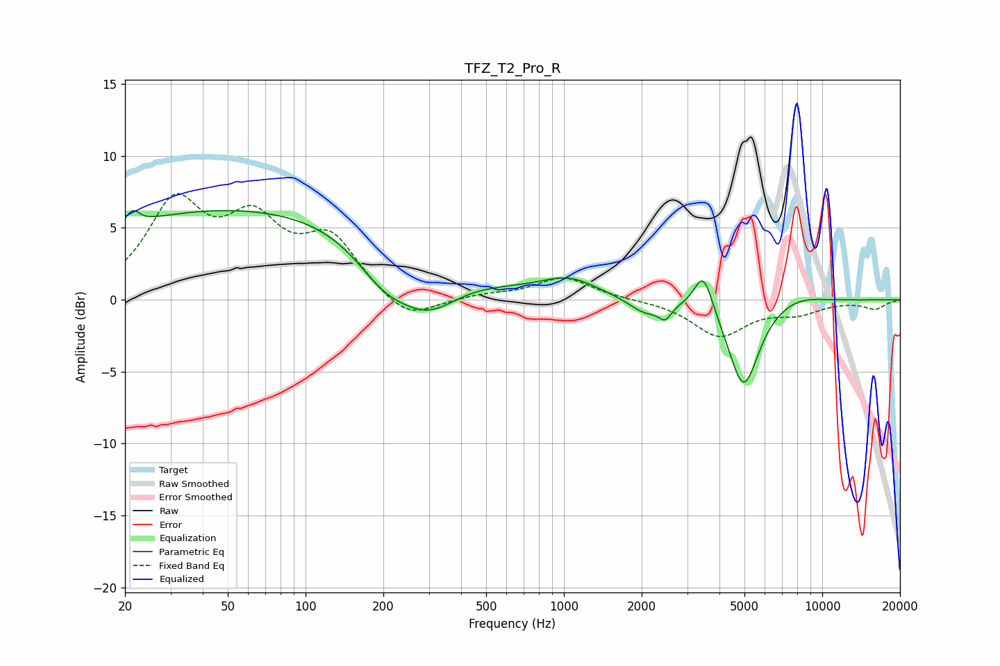

# TFZ_T2_Pro_R
See [usage instructions](https://github.com/jaakkopasanen/AutoEq#usage) for more options and info.

### Parametric EQs
Apply preamp of -6.3 dB when using parametric equalizer.

|   # | Type    |   Fc (Hz) |    Q |   Gain (dB) |
|-----|---------|-----------|------|-------------|
|   1 | Peaking |        21 | 5.8  |         1   |
|   2 | Peaking |        61 | 0.18 |         6.4 |
|   3 | Peaking |       202 | 1.22 |        -2.7 |
|   4 | Peaking |       298 | 1.17 |        -3.1 |
|   5 | Peaking |      1049 | 1.28 |         1.3 |
|   6 | Peaking |      2064 | 2.21 |        -1   |
|   7 | Peaking |      2468 | 5.9  |        -0.9 |
|   8 | Peaking |      3467 | 3.93 |         2.8 |
|   9 | Peaking |      4961 | 2.34 |        -6.1 |
|  10 | Peaking |      8020 | 1.36 |         0.5 |

### Fixed Band EQs
When using fixed band (also called graphic) equalizer, apply preamp of **-7.5 dB** (if available) and set gains manually with these parameters.

|   # | Type    |   Fc (Hz) |    Q |   Gain (dB) |
|-----|---------|-----------|------|-------------|
|   1 | Peaking |        31 | 1.41 |         6.4 |
|   2 | Peaking |        62 | 1.41 |         4.7 |
|   3 | Peaking |       125 | 1.41 |         3.9 |
|   4 | Peaking |       250 | 1.41 |        -1.7 |
|   5 | Peaking |       500 | 1.41 |         0.3 |
|   6 | Peaking |      1000 | 1.41 |         1.6 |
|   7 | Peaking |      2000 | 1.41 |         0   |
|   8 | Peaking |      4000 | 1.41 |        -2.5 |
|   9 | Peaking |      8000 | 1.41 |        -0.8 |
|  10 | Peaking |     16000 | 1.41 |        -0.6 |

### Graphs

