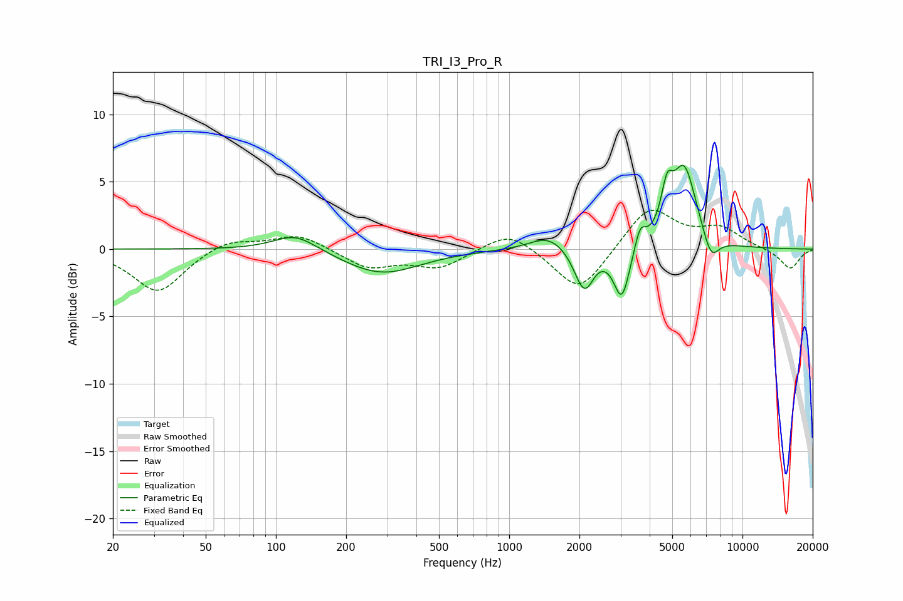

# TRI_I3_Pro_R
See [usage instructions](https://github.com/jaakkopasanen/AutoEq#usage) for more options and info.

### Parametric EQs
Apply preamp of -6.3 dB when using parametric equalizer.

|   # | Type    |   Fc (Hz) |    Q |   Gain (dB) |
|-----|---------|-----------|------|-------------|
|   1 | Peaking |       121 | 1.5  |         1.3 |
|   2 | Peaking |       284 | 0.87 |        -1.9 |
|   3 | Peaking |      1473 | 1.8  |         1.1 |
|   4 | Peaking |      1997 | 3.53 |        -0.8 |
|   5 | Peaking |      2122 | 3.76 |        -2.4 |
|   6 | Peaking |      3040 | 4.1  |        -3.9 |
|   7 | Peaking |      3640 | 6    |         1.6 |
|   8 | Peaking |      4747 | 5.7  |         2.8 |
|   9 | Peaking |      5625 | 2.58 |         6   |
|  10 | Peaking |      7324 | 3.87 |        -1.9 |

### Fixed Band EQs
When using fixed band (also called graphic) equalizer, apply preamp of **-3.0 dB** (if available) and set gains manually with these parameters.

|   # | Type    |   Fc (Hz) |    Q |   Gain (dB) |
|-----|---------|-----------|------|-------------|
|   1 | Peaking |        31 | 1.41 |        -3.2 |
|   2 | Peaking |        62 | 1.41 |         0.8 |
|   3 | Peaking |       125 | 1.41 |         1.1 |
|   4 | Peaking |       250 | 1.41 |        -1.4 |
|   5 | Peaking |       500 | 1.41 |        -1.3 |
|   6 | Peaking |      1000 | 1.41 |         1.5 |
|   7 | Peaking |      2000 | 1.41 |        -3.4 |
|   8 | Peaking |      4000 | 1.41 |         3.2 |
|   9 | Peaking |      8000 | 1.41 |         1.4 |
|  10 | Peaking |     16000 | 1.41 |        -1.5 |

### Graphs

