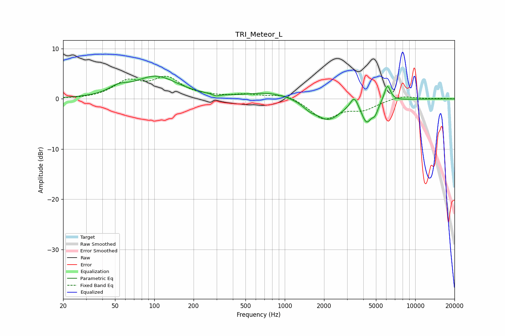

# TRI_Meteor_L
See [usage instructions](https://github.com/jaakkopasanen/AutoEq#usage) for more options and info.

### Parametric EQs
Apply preamp of -4.6 dB when using parametric equalizer.

|   # | Type    |   Fc (Hz) |    Q |   Gain (dB) |
|-----|---------|-----------|------|-------------|
|   1 | Peaking |        53 | 2.01 |         1.3 |
|   2 | Peaking |       103 | 0.85 |         4.4 |
|   3 | Peaking |       297 | 5.05 |        -0.4 |
|   4 | Peaking |       766 | 0.85 |         1.3 |
|   5 | Peaking |      1554 | 2.7  |        -1   |
|   6 | Peaking |      2160 | 1.42 |        -4.1 |
|   7 | Peaking |      3411 | 4.84 |         2.4 |
|   8 | Peaking |      4236 | 3.63 |        -4   |
|   9 | Peaking |      4924 | 6    |        -1.8 |
|  10 | Peaking |      6121 | 5.75 |         3.3 |

### Fixed Band EQs
When using fixed band (also called graphic) equalizer, apply preamp of **-4.6 dB** (if available) and set gains manually with these parameters.

|   # | Type    |   Fc (Hz) |    Q |   Gain (dB) |
|-----|---------|-----------|------|-------------|
|   1 | Peaking |        31 | 1.41 |        -0   |
|   2 | Peaking |        62 | 1.41 |         3.2 |
|   3 | Peaking |       125 | 1.41 |         3.8 |
|   4 | Peaking |       250 | 1.41 |         0.3 |
|   5 | Peaking |       500 | 1.41 |         0.8 |
|   6 | Peaking |      1000 | 1.41 |         1.1 |
|   7 | Peaking |      2000 | 1.41 |        -3.9 |
|   8 | Peaking |      4000 | 1.41 |        -1.8 |
|   9 | Peaking |      8000 | 1.41 |         0.7 |
|  10 | Peaking |     16000 | 1.41 |         0.1 |

### Graphs

