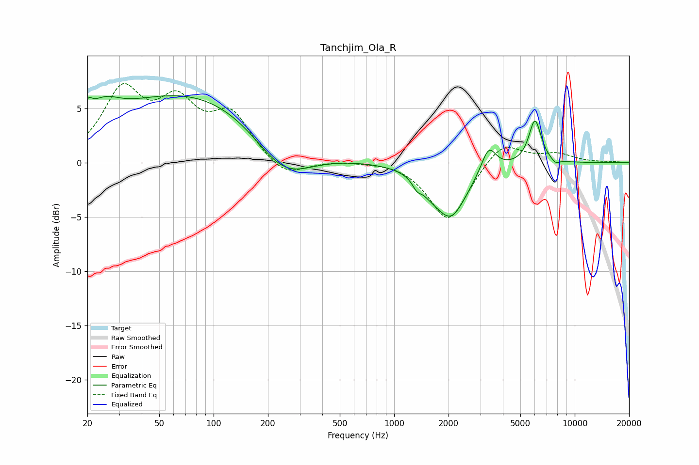

# Tanchjim_Ola_R
See [usage instructions](https://github.com/jaakkopasanen/AutoEq#usage) for more options and info.

### Parametric EQs
Apply preamp of -6.3 dB when using parametric equalizer.

|   # | Type    |   Fc (Hz) |    Q |   Gain (dB) |
|-----|---------|-----------|------|-------------|
|   1 | Peaking |        20 | 5.97 |         1.3 |
|   2 | Peaking |        24 | 1.6  |         2   |
|   3 | Peaking |        76 | 0.29 |         6.5 |
|   4 | Peaking |       242 | 0.86 |        -4.1 |
|   5 | Peaking |      1336 | 5.89 |        -0.7 |
|   6 | Peaking |      1579 | 2.45 |        -0.8 |
|   7 | Peaking |      2062 | 1.59 |        -4.8 |
|   8 | Peaking |      3339 | 3.51 |         2.3 |
|   9 | Peaking |      6023 | 4.03 |         4   |
|  10 | Peaking |      7806 | 5.99 |        -0.4 |

### Fixed Band EQs
When using fixed band (also called graphic) equalizer, apply preamp of **-7.4 dB** (if available) and set gains manually with these parameters.

|   # | Type    |   Fc (Hz) |    Q |   Gain (dB) |
|-----|---------|-----------|------|-------------|
|   1 | Peaking |        31 | 1.41 |         6.2 |
|   2 | Peaking |        62 | 1.41 |         4.7 |
|   3 | Peaking |       125 | 1.41 |         4.1 |
|   4 | Peaking |       250 | 1.41 |        -1.6 |
|   5 | Peaking |       500 | 1.41 |         0.2 |
|   6 | Peaking |      1000 | 1.41 |         0.2 |
|   7 | Peaking |      2000 | 1.41 |        -5.5 |
|   8 | Peaking |      4000 | 1.41 |         2.2 |
|   9 | Peaking |      8000 | 1.41 |         0.8 |
|  10 | Peaking |     16000 | 1.41 |         0.1 |

### Graphs

