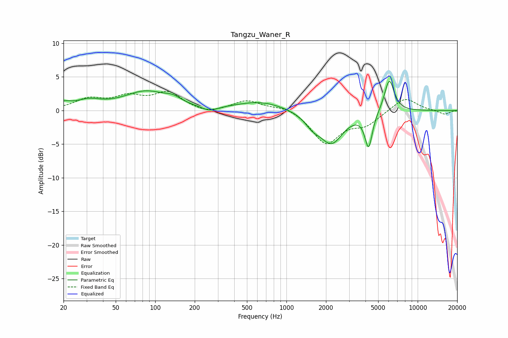

# Tangzu_Waner_R
See [usage instructions](https://github.com/jaakkopasanen/AutoEq#usage) for more options and info.

### Parametric EQs
Apply preamp of -4.4 dB when using parametric equalizer.

|   # | Type    |   Fc (Hz) |    Q |   Gain (dB) |
|-----|---------|-----------|------|-------------|
|   1 | Peaking |        20 | 2.78 |         0.8 |
|   2 | Peaking |        31 | 1.48 |         1.2 |
|   3 | Peaking |        85 | 0.84 |         2.7 |
|   4 | Peaking |       137 | 2.32 |         0.7 |
|   5 | Peaking |       259 | 2.27 |        -0.8 |
|   6 | Peaking |       639 | 0.78 |         1.3 |
|   7 | Peaking |      1577 | 2.38 |        -1.4 |
|   8 | Peaking |      2203 | 1.58 |        -4.7 |
|   9 | Peaking |      4228 | 4.94 |        -5.1 |
|  10 | Peaking |      6072 | 3.66 |         4.9 |

### Fixed Band EQs
When using fixed band (also called graphic) equalizer, apply preamp of **-2.9 dB** (if available) and set gains manually with these parameters.

|   # | Type    |   Fc (Hz) |    Q |   Gain (dB) |
|-----|---------|-----------|------|-------------|
|   1 | Peaking |        31 | 1.41 |         1.6 |
|   2 | Peaking |        62 | 1.41 |         1.8 |
|   3 | Peaking |       125 | 1.41 |         2.5 |
|   4 | Peaking |       250 | 1.41 |        -0.6 |
|   5 | Peaking |       500 | 1.41 |         1.5 |
|   6 | Peaking |      1000 | 1.41 |         0.7 |
|   7 | Peaking |      2000 | 1.41 |        -4.8 |
|   8 | Peaking |      4000 | 1.41 |        -1.9 |
|   9 | Peaking |      8000 | 1.41 |         2   |
|  10 | Peaking |     16000 | 1.41 |        -0.6 |

### Graphs

