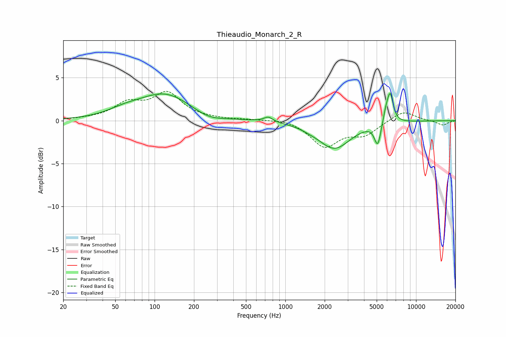

# Thieaudio_Monarch_2_R
See [usage instructions](https://github.com/jaakkopasanen/AutoEq#usage) for more options and info.

### Parametric EQs
Apply preamp of -3.3 dB when using parametric equalizer.

|   # | Type    |   Fc (Hz) |    Q |   Gain (dB) |
|-----|---------|-----------|------|-------------|
|   1 | Peaking |        59 | 1.13 |         0.6 |
|   2 | Peaking |       120 | 0.7  |         3.1 |
|   3 | Peaking |       258 | 1.24 |        -0.8 |
|   4 | Peaking |       741 | 4.18 |         0.6 |
|   5 | Peaking |      1525 | 2.56 |        -0.1 |
|   6 | Peaking |      2373 | 1.14 |        -3.2 |
|   7 | Peaking |      4922 | 6    |        -0.4 |
|   8 | Peaking |      5118 | 6    |        -2.3 |
|   9 | Peaking |      5892 | 5.99 |         1.2 |
|  10 | Peaking |      6347 | 5.96 |         3.2 |

### Fixed Band EQs
When using fixed band (also called graphic) equalizer, apply preamp of **-3.5 dB** (if available) and set gains manually with these parameters.

|   # | Type    |   Fc (Hz) |    Q |   Gain (dB) |
|-----|---------|-----------|------|-------------|
|   1 | Peaking |        31 | 1.41 |         0.1 |
|   2 | Peaking |        62 | 1.41 |         1.8 |
|   3 | Peaking |       125 | 1.41 |         3   |
|   4 | Peaking |       250 | 1.41 |         0.1 |
|   5 | Peaking |       500 | 1.41 |         0.1 |
|   6 | Peaking |      1000 | 1.41 |         0.3 |
|   7 | Peaking |      2000 | 1.41 |        -2.9 |
|   8 | Peaking |      4000 | 1.41 |        -1.5 |
|   9 | Peaking |      8000 | 1.41 |         1.2 |
|  10 | Peaking |     16000 | 1.41 |        -0.5 |

### Graphs

