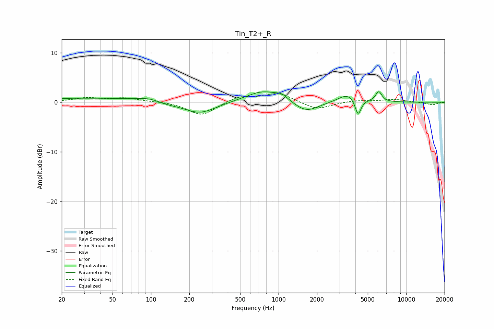

# Tin_T2+_R
See [usage instructions](https://github.com/jaakkopasanen/AutoEq#usage) for more options and info.

### Parametric EQs
Apply preamp of -2.2 dB when using parametric equalizer.

|   # | Type    |   Fc (Hz) |    Q |   Gain (dB) |
|-----|---------|-----------|------|-------------|
|   1 | Peaking |        36 | 0.26 |         0.8 |
|   2 | Peaking |        99 | 1.73 |         0.7 |
|   3 | Peaking |       130 | 1.45 |        -0.5 |
|   4 | Peaking |       241 | 1.14 |        -2.4 |
|   5 | Peaking |       759 | 1.05 |         2.4 |
|   6 | Peaking |      1063 | 3.05 |         0.9 |
|   7 | Peaking |      1645 | 1.48 |        -2.2 |
|   8 | Peaking |      3496 | 1.92 |         1.8 |
|   9 | Peaking |      4197 | 6    |        -3.4 |
|  10 | Peaking |      6095 | 5.57 |         2.1 |

### Fixed Band EQs
When using fixed band (also called graphic) equalizer, apply preamp of **-1.8 dB** (if available) and set gains manually with these parameters.

|   # | Type    |   Fc (Hz) |    Q |   Gain (dB) |
|-----|---------|-----------|------|-------------|
|   1 | Peaking |        31 | 1.41 |         0.8 |
|   2 | Peaking |        62 | 1.41 |         0.8 |
|   3 | Peaking |       125 | 1.41 |         0.1 |
|   4 | Peaking |       250 | 1.41 |        -2.7 |
|   5 | Peaking |       500 | 1.41 |         1.3 |
|   6 | Peaking |      1000 | 1.41 |         1.8 |
|   7 | Peaking |      2000 | 1.41 |        -1.5 |
|   8 | Peaking |      4000 | 1.41 |         0.4 |
|   9 | Peaking |      8000 | 1.41 |         0.6 |
|  10 | Peaking |     16000 | 1.41 |        -0.5 |

### Graphs

