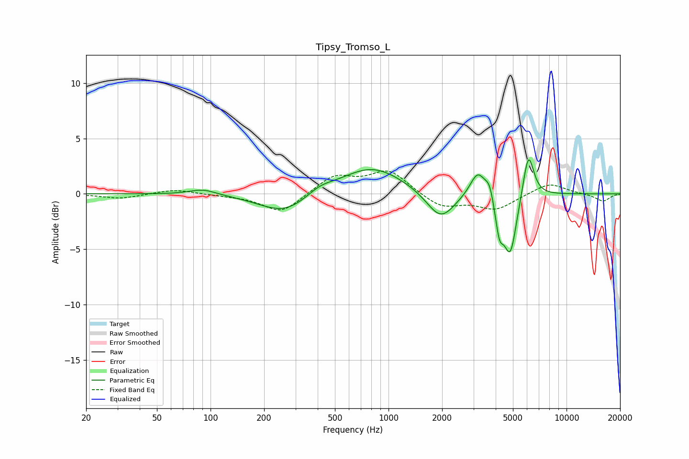

# Tipsy_Tromso_L
See [usage instructions](https://github.com/jaakkopasanen/AutoEq#usage) for more options and info.

### Parametric EQs
Apply preamp of -3.2 dB when using parametric equalizer.

|   # | Type    |   Fc (Hz) |    Q |   Gain (dB) |
|-----|---------|-----------|------|-------------|
|   1 | Peaking |        91 | 1.87 |         0.5 |
|   2 | Peaking |       261 | 0.98 |        -1.9 |
|   3 | Peaking |       411 | 1.93 |         0.6 |
|   4 | Peaking |       805 | 0.8  |         2.5 |
|   5 | Peaking |      1963 | 1.79 |        -2.6 |
|   6 | Peaking |      3177 | 3.22 |         2.3 |
|   7 | Peaking |      3699 | 6    |         1.3 |
|   8 | Peaking |      4195 | 5.99 |        -2.9 |
|   9 | Peaking |      4831 | 3.84 |        -5.4 |
|  10 | Peaking |      6108 | 4.55 |         4.2 |

### Fixed Band EQs
When using fixed band (also called graphic) equalizer, apply preamp of **-2.2 dB** (if available) and set gains manually with these parameters.

|   # | Type    |   Fc (Hz) |    Q |   Gain (dB) |
|-----|---------|-----------|------|-------------|
|   1 | Peaking |        31 | 1.41 |        -0.4 |
|   2 | Peaking |        62 | 1.41 |         0.4 |
|   3 | Peaking |       125 | 1.41 |        -0.1 |
|   4 | Peaking |       250 | 1.41 |        -1.8 |
|   5 | Peaking |       500 | 1.41 |         1.6 |
|   6 | Peaking |      1000 | 1.41 |         2.1 |
|   7 | Peaking |      2000 | 1.41 |        -1.3 |
|   8 | Peaking |      4000 | 1.41 |        -1.4 |
|   9 | Peaking |      8000 | 1.41 |         1   |
|  10 | Peaking |     16000 | 1.41 |        -0.7 |

### Graphs

