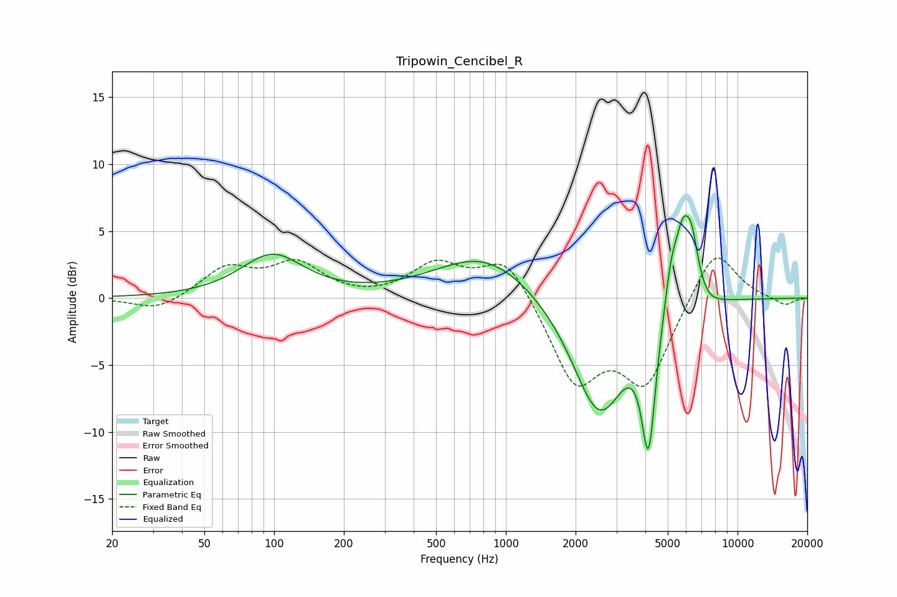

# Tripowin_Cencibel_R
See [usage instructions](https://github.com/jaakkopasanen/AutoEq#usage) for more options and info.

### Parametric EQs
Apply preamp of -6.2 dB when using parametric equalizer.

|   # | Type    |   Fc (Hz) |    Q |   Gain (dB) |
|-----|---------|-----------|------|-------------|
|   1 | Peaking |        98 | 1.05 |         3.2 |
|   2 | Peaking |       817 | 0.66 |         3.3 |
|   3 | Peaking |      2464 | 1.21 |        -7.6 |
|   4 | Peaking |      2773 | 1.75 |        -1.4 |
|   5 | Peaking |      4128 | 6    |        -1.5 |
|   6 | Peaking |      4132 | 4.45 |        -8.1 |
|   7 | Peaking |      5183 | 4.29 |         3.5 |
|   8 | Peaking |      5797 | 4.53 |         3.8 |
|   9 | Peaking |      6326 | 4.22 |         4.3 |
|  10 | Peaking |      7358 | 2.66 |        -0.5 |

### Fixed Band EQs
When using fixed band (also called graphic) equalizer, apply preamp of **-3.1 dB** (if available) and set gains manually with these parameters.

|   # | Type    |   Fc (Hz) |    Q |   Gain (dB) |
|-----|---------|-----------|------|-------------|
|   1 | Peaking |        31 | 1.41 |        -1   |
|   2 | Peaking |        62 | 1.41 |         2.2 |
|   3 | Peaking |       125 | 1.41 |         2.4 |
|   4 | Peaking |       250 | 1.41 |        -0.1 |
|   5 | Peaking |       500 | 1.41 |         2.4 |
|   6 | Peaking |      1000 | 1.41 |         3.2 |
|   7 | Peaking |      2000 | 1.41 |        -6.2 |
|   8 | Peaking |      4000 | 1.41 |        -6.1 |
|   9 | Peaking |      8000 | 1.41 |         4   |
|  10 | Peaking |     16000 | 1.41 |        -0.6 |

### Graphs

