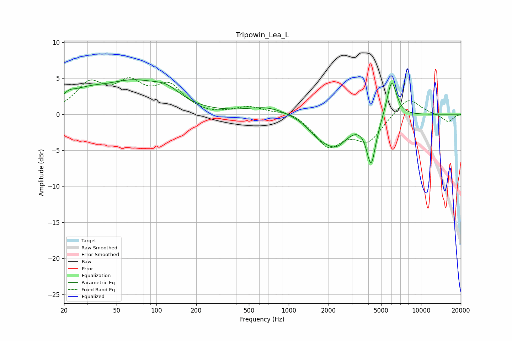

# Tripowin_Lea_L
See [usage instructions](https://github.com/jaakkopasanen/AutoEq#usage) for more options and info.

### Parametric EQs
Apply preamp of -4.9 dB when using parametric equalizer.

|   # | Type    |   Fc (Hz) |    Q |   Gain (dB) |
|-----|---------|-----------|------|-------------|
|   1 | Peaking |        22 | 3.35 |         0.7 |
|   2 | Peaking |        29 | 0.86 |         2.2 |
|   3 | Peaking |        67 | 0.67 |         3.7 |
|   4 | Peaking |       120 | 1.33 |         1.7 |
|   5 | Peaking |       694 | 0.94 |         1.1 |
|   6 | Peaking |      1657 | 1.68 |        -1.6 |
|   7 | Peaking |      2265 | 1.46 |        -3.7 |
|   8 | Peaking |      4199 | 4.09 |        -6.2 |
|   9 | Peaking |      4672 | 2.07 |        -0.4 |
|  10 | Peaking |      6003 | 3.66 |         5.3 |

### Fixed Band EQs
When using fixed band (also called graphic) equalizer, apply preamp of **-5.2 dB** (if available) and set gains manually with these parameters.

|   # | Type    |   Fc (Hz) |    Q |   Gain (dB) |
|-----|---------|-----------|------|-------------|
|   1 | Peaking |        31 | 1.41 |         3.9 |
|   2 | Peaking |        62 | 1.41 |         3.7 |
|   3 | Peaking |       125 | 1.41 |         3.6 |
|   4 | Peaking |       250 | 1.41 |        -0.2 |
|   5 | Peaking |       500 | 1.41 |         1   |
|   6 | Peaking |      1000 | 1.41 |         0.6 |
|   7 | Peaking |      2000 | 1.41 |        -4.3 |
|   8 | Peaking |      4000 | 1.41 |        -3.5 |
|   9 | Peaking |      8000 | 1.41 |         2.5 |
|  10 | Peaking |     16000 | 1.41 |        -1.1 |

### Graphs

