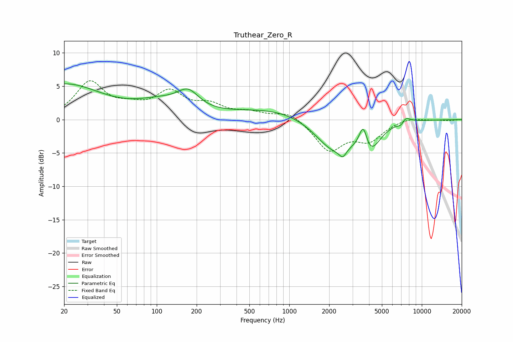

# Truthear_Zero_R
See [usage instructions](https://github.com/jaakkopasanen/AutoEq#usage) for more options and info.

### Parametric EQs
Apply preamp of -5.5 dB when using parametric equalizer.

|   # | Type    |   Fc (Hz) |    Q |   Gain (dB) |
|-----|---------|-----------|------|-------------|
|   1 | Peaking |        20 | 0.5  |         5.2 |
|   2 | Peaking |       107 | 0.76 |         2   |
|   3 | Peaking |       173 | 1.75 |         2.6 |
|   4 | Peaking |      1220 | 0.32 |         2.2 |
|   5 | Peaking |      2183 | 0.88 |        -6   |
|   6 | Peaking |      2533 | 5.47 |        -1.2 |
|   7 | Peaking |      3617 | 4.41 |         4.1 |
|   8 | Peaking |      4017 | 1.89 |        -4.3 |
|   9 | Peaking |      7098 | 4.15 |        -2.4 |
|  10 | Peaking |      7280 | 3.57 |         2.6 |

### Fixed Band EQs
When using fixed band (also called graphic) equalizer, apply preamp of **-5.9 dB** (if available) and set gains manually with these parameters.

|   # | Type    |   Fc (Hz) |    Q |   Gain (dB) |
|-----|---------|-----------|------|-------------|
|   1 | Peaking |        31 | 1.41 |         5.4 |
|   2 | Peaking |        62 | 1.41 |         1.4 |
|   3 | Peaking |       125 | 1.41 |         3.8 |
|   4 | Peaking |       250 | 1.41 |         1.8 |
|   5 | Peaking |       500 | 1.41 |         0.9 |
|   6 | Peaking |      1000 | 1.41 |         1.3 |
|   7 | Peaking |      2000 | 1.41 |        -4.5 |
|   8 | Peaking |      4000 | 1.41 |        -2.8 |
|   9 | Peaking |      8000 | 1.41 |         0.4 |
|  10 | Peaking |     16000 | 1.41 |        -0.1 |

### Graphs

