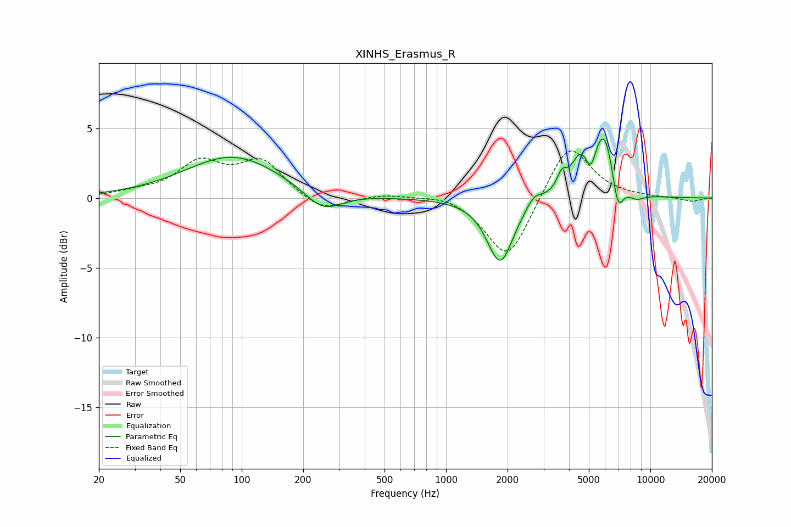

# XINHS_Erasmus_R
See [usage instructions](https://github.com/jaakkopasanen/AutoEq#usage) for more options and info.

### Parametric EQs
Apply preamp of -4.3 dB when using parametric equalizer.

|   # | Type    |   Fc (Hz) |    Q |   Gain (dB) |
|-----|---------|-----------|------|-------------|
|   1 | Peaking |        91 | 0.61 |         3   |
|   2 | Peaking |       250 | 1.61 |        -1.5 |
|   3 | Peaking |      1842 | 2.22 |        -4.7 |
|   4 | Peaking |      2704 | 3.72 |         0.8 |
|   5 | Peaking |      3683 | 6    |         1.1 |
|   6 | Peaking |      4528 | 3.06 |         2.2 |
|   7 | Peaking |      5114 | 6    |        -1.4 |
|   8 | Peaking |      5940 | 2.51 |         4.8 |
|   9 | Peaking |      6914 | 4.78 |        -2.7 |
|  10 | Peaking |      8481 | 2.99 |        -0.6 |

### Fixed Band EQs
When using fixed band (also called graphic) equalizer, apply preamp of **-3.5 dB** (if available) and set gains manually with these parameters.

|   # | Type    |   Fc (Hz) |    Q |   Gain (dB) |
|-----|---------|-----------|------|-------------|
|   1 | Peaking |        31 | 1.41 |         0.3 |
|   2 | Peaking |        62 | 1.41 |         2.4 |
|   3 | Peaking |       125 | 1.41 |         2.5 |
|   4 | Peaking |       250 | 1.41 |        -1.1 |
|   5 | Peaking |       500 | 1.41 |         0.3 |
|   6 | Peaking |      1000 | 1.41 |         0.4 |
|   7 | Peaking |      2000 | 1.41 |        -4.6 |
|   8 | Peaking |      4000 | 1.41 |         4.1 |
|   9 | Peaking |      8000 | 1.41 |         0   |
|  10 | Peaking |     16000 | 1.41 |        -0.3 |

### Graphs

